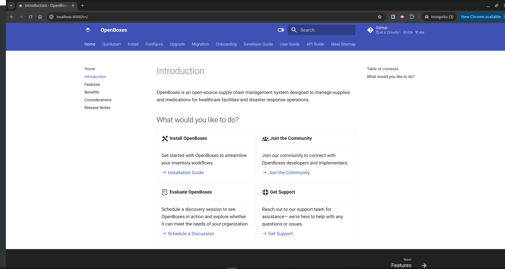

# Getting Started 

## Prerequisites

1. Verify **python 3** and **python-pip** are installed. 
    ```sh
    python3 --version
    pip3 --version
    ```
## Install mkdocs

1. If you intend to contribute changes and you do not have commit privileges for the openboxes/openboxes project, create a fork of the repository and use that.  For details, see [__Contributing__](developer-guide/contributing.md).

1. Clone the repository.
    ```shell
    git clone git@github.com:openboxes/openboxes.git
    cd openboxes
    ```
1. Create a Python environment in this cloned repo.
    ```shell
    pip3 install virtualenv
    mkdir python
    virtualenv python  # create a python env in the python subdir with bin, lib subdirs
    source python/bin/activate # configure shell session for this python env
    which pip # confirm that we are now running in the virtual env
    ```
1. Install required mkdocs dependencies in this env.
    ```shell
    pip install -r docs/requirements.txt
    ```

# Build the docs and run a local server.

1. Run the mkdocs server
    ```shell
    mkdocs serve &
    ```
1. Open docs in browser

[](http://localhost:8000)


## Contributing

1. Create a new branch for your documentation changes
```shell
git checkout -b docs/1234-fix-typo
```

> [!TIP]
>   Branching naming should follow convention above. If possible, use the GitHub issue number 
>   and summary in your branch name.

2. Make documentation changes in an editor of your choice
3. Commit changes to branch with meaningful commit message 
```
git commit -m "#1234: fixed typo in docs"
```
4. Push changes to GitHub
5. Create a pull request
6. Assign `jmiranda` as a reviewer
