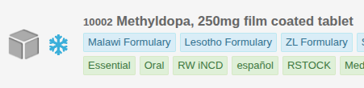

Identifiers are used throughout OpenBoxes as a way to uniquely identify some entity without needing to rely on the
internal database id of the object.

For example, the product in the image below might have an id of `09f5e1167e544c20017e5a2483672b5d`, which is too
long to display in the UI, so instead we generate and assign it a product code of `10002`, which is much shorter.



Many entities in OpenBoxes rely on identifiers, including: Transactions, Products, Suppliers, Organizations, and Orders.

## Base Configuration
The format of an identifier is configurable via the following properties:

- `openboxes.identifier.default.format`: The default format to use when generating an identifier. There are a number
of keywords that you can use when specifying the format:
    - `\${random}`: A randomly generated sequence as defined in `random.template`. See the section below for details.
    - `\${delimiter}`: The separator character.
    - `\${sequenceNumber}`: A sequential, incrementing number. See the section below for details.
    - `\${abbreviation}`: An abbreviation of some field on the entity. See the section below for details.
    - `\${custom.*}`: Adds a custom value to the identifier. See the section below for details.
- `openboxes.identifier.default.delimiter`: The separator character to use between fields of the identifier. Is
inserted whenever `\${delimiter}` appears in the format.
- `openboxes.identifier.default.prefix.enabled`: True if we allow custom prefix characters to be prepended to the
identifier. The prefix is specified in the code so is highly feature-specific and not configurable. This is typically
used to emphasize the domain that we're generating an identifier for. For example, we prepend "PO-" to the identifier
for purchase orders.

!!! warning
    Remember that identifiers are meant to be unique, and so it is important that your format can generate unique
    values. We highly suggest you include at least one of the following to each format:

    1) A random piece via `\${random}`

    2) A sequential piece via `\${sequenceNumber}` (if the entity supports it)

    3) A combination of custom or entity fields that are guaranteed to be unique

You can see our default property configurations in `/grail-apps/conf/runtime.groovy`

## Overriding Base Configuration
In case you don't want to use a single format across all of your entity types, most of the identifier configuration
options can be overwritten at the feature level. To do so, simply replace "default" with the camelCase feature name
of the entity you want to configure.

For example, if you have the following config:
```yaml
openboxes.identifier.default.format: "\${random}"
openboxes.identifier.product.format: "\${sequenceNumber}"
openboxes.identifier.purchaseOrder.format: "PO-\${sequenceNumber}"
```
Then products will use a sequential number as their identifier, purchase orders will use a sequence number with a
prepended "PO-" string, and everything else will use a randomly generated value.

## Randomization
Randomization can be added to the identifier by adding `"\${random}"` to the format. How the randomization is generated
can be configured in a number of ways:

- `openboxes.identifier.attempts.max`: The maximum number of times to attempt to generate the random identifier before
  giving up. Useful in case we happen to generate a random value that already exists.
- `openboxes.identifier.numeric`: The set of characters to select from when populating the `N` (number) character in
the random sequence
- `openboxes.identifier.alphabetic`: The set of characters to select from when populating the `L` (letter) character
in the random sequence
- `openboxes.identifier.alphanumeric`: The set of characters to select from when populating the `A` (alphanumeric)
character in the random sequence
- `openboxes.identifier.default.random.template`: A combination of 'N', 'L', and 'A' representing the structure of the
random sequence. Any other characters will be kept as is. Ex: "-NNNLLL" will generate something like "-742JKD"
- `openboxes.identifier.default.random.condition`: Defines when to add the random piece of the identifier.
    - ALWAYS: The random sequence is always generated as a part of the identifier.
    - ON_DUPLICATE: Only add a random sequence to the identifier if the identifier is not unique without it.

A config using randomization might look like:
```yaml
openboxes.identifier.default.format: "\${random}"
openboxes.identifier.default.random.template: "NNNLLL"
openboxes.identifier.default.random.condition: RandomCondition.ALWAYS
```

## Sequential Ids
A sequential, incrementing number can be added to the identifier by adding `\${sequenceNumber}` to the format. This
sequence number will be incremented whenever a new identifier is generated for the entity type so is useful when you
need to track the order that ids were generated in.

!!! note
    For sequential ids to work, the entity must have a join on the "sequences" database table, which only a small subset
    of the entities do. As such, a majority of the entities cannot use sequential number in their identifier.

The format of the sequential number can be configured via:
- `openboxes.identifier.default.sequenceNumber.minSize`: The minimum number of digits in the identifier. Any number
smaller than this will be padded with zeroes. Ex: if minSize = 5, and we generate 13, it will output 00013.

## Abbreviation
An abbreviation of a field can be added to the identifier by adding `\${abbreviation}` to the format. This can be
useful if you want your identifier to have a somewhat recognizable value.

For example, if given the string "Apple Berry Cherry", the resulting abbreviation would be "ABC". If your minSize = 4,
then that wouldn't be enough characters so it will instead pull the first 4 characters of the string, resulting in the
identifier being "APPL".

- `openboxes.identifier.default.abbreviation.minSize`: The minimum number of characters in the abbreviation
- `openboxes.identifier.default.abbreviation.maxSize`: The maximum number of characters in the abbreviation
- `openboxes.identifier.*.abbreviation.field`: Which field of the entity to abbreviate

A config using abbreviation might look like:
```yaml
openboxes.identifier.organization.format: "\${abbreviation}\${random}"
openboxes.identifier.organization.random.template: "-NNNLLL"
openboxes.identifier.organization.random.condition: RandomCondition.ON_DUPLICATE
openboxes.identifier.organization.abbreviation.field: "name"
```

## Entity Fields
You can add the value of fields/properties of the entity to the identifier as long as the field implements the
`toString()` method.

To add an entity field you must add the field as a `\${<field_name>}` key in the format and specify a "properties"
map, with the key being the `<field_name>` you used in the format, and the value being the path to access the field.

For example:
```yaml
openboxes.identifier.purchaseOrder.format: "\${name}\${sequenceNumber}"
openboxes.identifier.purchaseOrder.properties: ["name": "name"]
```
Will pull the name field of the purchase order and use that as a prefix for the identifier.

The field does not need to be directly on the entity that you're generating the identifier for. You can traverse entity
relationships to get field values for the identifier.

For example:
```yaml
openboxes.identifier.purchaseOrder.format: "\${destinationPartyCode}\${sequenceNumber}"
openboxes.identifier.purchaseOrder.properties: ["destinationPartyCode": "destinationParty.code"]
```
Will pull the code of the destination party of the entity by querying `entity.destinationParty.code`.

## Custom Fields
Custom fields are specified by prefixing them with "custom." and are a way to add fields to the identifier that are
not from the entity itself.

!!! note
    The set of supported custom fields for an entity is defined in the code and must be directly provided in the context
    object when generating the identifier. As such, only some entities support custom fields, and adding a new custom
    field requires a code change.

For example, if you have the following config:
```yaml
openboxes.identifier.productSupplier.format: "\${custom.organizationCode}"
```
It will expect that the code provides a custom field "organizationCode" which will be used to populate the identifier.
In this case, the result of this config is that the identifier of the supplier is the identifier of its organization.
