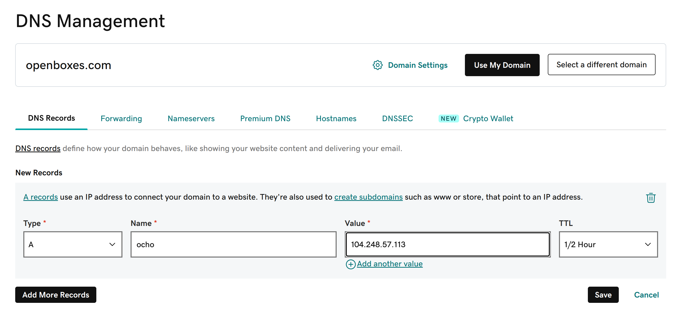
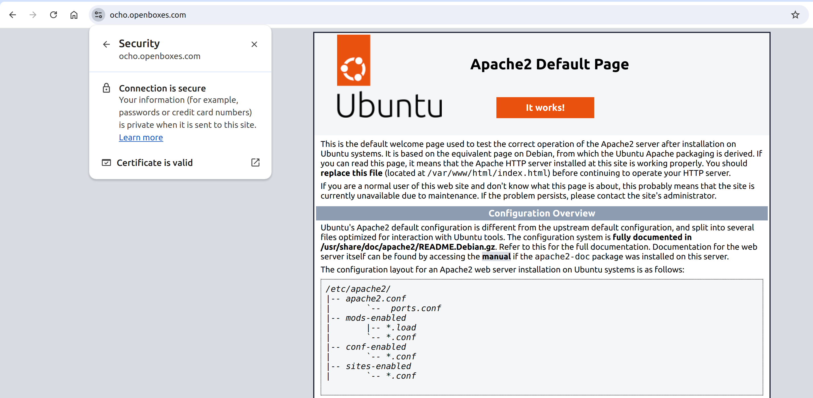
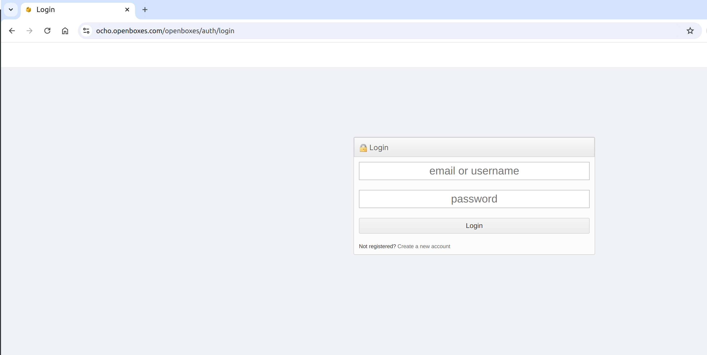

## Enable HTTPS using Cerbot

### Step 1. Register domain name with domain registrar

You can use any domain registrar to register your domain name. You are essentially looking to register a friendly domain
name (`<your-domain-name>.com`) and then create DNS records to map between a domain name and the public IP address that was assigned to the Virtual Machine
by your hosting provider.

The following resources will guide you through the process of registering and managing domain names with each respective provider.

2. [Amazon Route 53](https://docs.aws.amazon.com/Route53/latest/DeveloperGuide/domain-register.html)
2. [Azure DNS](https://learn.microsoft.com/en-us/azure/dns/dns-getstarted-portal)
5. [DigitalOcean DNS](https://docs.digitalocean.com/products/networking/dns/getting-started/quickstart/)
5. [Google Domains](https://domains.google/)
6. [Hover Domain Registration Guide](https://help.hover.com/hc/en-us/articles/217281447-Registering-a-Domain-Name)
4. [Linode DNS Manager](https://www.linode.com/docs/platform/manager/dns-manager/)
4. [GoDaddy Domain Registration Guide](https://www.godaddy.com/help/registering-a-domain-name-370)
5. [Namecheap Domain Registration Guide](https://www.namecheap.com/support/knowledgebase/article.aspx/9622/2237/how-to-register-a-new-domain-name/)
5. [Rimuhosting DNS](https://rimuhosting.com/dns/aboutdns.jsp)

### Step 2. Create a DNS record for the new domain (or subdomain)

Use the same resource from Step 2 to create DNS records (A, CNAME) for the default server URL as well
as any subdomains.

Here's an example of what it looks like registering an A record for a subdomain of openboxes.com



### Step 3. Verify traffic is routed to server

Once you have completed the domain registration process you should now have your domain name mapped
to an IP address (A record) and you should be able to navigate to your server using the following URL.
```
http://<your-domain-name>.com:8080/openboxes
```
If you set up a subdomain you should be able to access openboxes using the following URL.
```
http://<your-subdomain>.<your-domain-name>.com:8080/openboxes
```

!!! note

    The astute observer will notice that after entering the domain name in the browser search bar
    and clicking enter, the browser redirects us back to the IP address. This is due to the `grails.serverURL`
    configuration still pointing to the IP address. We'll fix that later.

    


### Step 4. Choose an SSL certificate provider

=== "Certbot (Let's Encrypt)"

    Certbot (Let's Encrypt) is ideal for those looking for a cost-effective, automated solution for basic SSL needs.
    
    * Certbot, in conjunction with Let’s Encrypt, provides SSL/TLS certificates at no cost.
    * Certbot automates the issuance, renewal, and installation of certificates, reducing manual effort.
    * Easy to set up, particularly for common server configurations like nginx and Apache.

=== "Certificate Authority"

    Purchased SSL Certificates are better suited for organizations needing higher levels of trust, support, and features like warranties.

    * Purchase an expensive SSL certificate from a reputable certificate authority. 
    * Purchased certificates can be valid for 1 to 2 years, reducing the need for frequent renewals.
    * You might need to manually install and renew the certificates, which can be time-consuming if not automated.
    * Paid SSL providers typically offer customer support to help with installation, troubleshooting, and management.
    * Setting up and managing paid SSL certificates can be more complex, especially if you are not familiar with SSL/TLS management.


### Step 5. Install Certbot

We recommend using Certbot since the manual approach is complicated, frustrating and requires manual
intervention when your SSL certificate expires.

To install Certbot, follow these instructions for the proxy server you chose above.

=== "Apache"

    [How To Secure Apache with Let's Encrypt on Ubuntu](https://www.digitalocean.com/community/tutorials/how-to-secure-apache-with-let-s-encrypt-on-ubuntu)

=== "nginx"

    [How To Secure Nginx with Let's Encrypt on Ubuntu](https://www.digitalocean.com/community/tutorials/how-to-secure-nginx-with-let-s-encrypt-on-ubuntu-22-04)


### Step 6. Verify Certbot

There are a few things to check to validate that things went smoothly.

=== "Browser"

    If all goes well, you should now be able to access the server over HTTPS using your 
    new domain name (`https://<your-domain-name>.com`) and you should see that web requests 
    over HTTPS are using a valid SSL certificate.
    
    

=== "stdout"

    Here's sample output from the last steps in the process from the Apache instructions.
    ```
    $ sudo certbot --apache
    Saving debug log to /var/log/letsencrypt/letsencrypt.log
    Enter email address (used for urgent renewal and security notices)
     (Enter 'c' to cancel): justin@openboxes.com
    
    - - - - - - - - - - - - - - - - - - - - - - - - - - - - - - - - - - - - - - - -
    Please read the Terms of Service at
    https://letsencrypt.org/documents/LE-SA-v1.4-April-3-2024.pdf. You must agree in
    order to register with the ACME server. Do you agree?
    - - - - - - - - - - - - - - - - - - - - - - - - - - - - - - - - - - - - - - - -
    (Y)es/(N)o: Y
    
    - - - - - - - - - - - - - - - - - - - - - - - - - - - - - - - - - - - - - - - -
    Would you be willing, once your first certificate is successfully issued, to
    share your email address with the Electronic Frontier Foundation, a founding
    partner of the Let's Encrypt project and the non-profit organization that
    develops Certbot? We'd like to send you email about our work encrypting the web,
    EFF news, campaigns, and ways to support digital freedom.
    - - - - - - - - - - - - - - - - - - - - - - - - - - - - - - - - - - - - - - - -
    (Y)es/(N)o: Y
    Account registered.
    
    Which names would you like to activate HTTPS for?
    - - - - - - - - - - - - - - - - - - - - - - - - - - - - - - - - - - - - - - - -
    1: ocho.openboxes.com
    - - - - - - - - - - - - - - - - - - - - - - - - - - - - - - - - - - - - - - - -
    Select the appropriate numbers separated by commas and/or spaces, or leave input
    blank to select all options shown (Enter 'c' to cancel): 
    Requesting a certificate for ocho.openboxes.com
    
    Successfully received certificate.
    Certificate is saved at: /etc/letsencrypt/live/ocho.openboxes.com/fullchain.pem
    Key is saved at:         /etc/letsencrypt/live/ocho.openboxes.com/privkey.pem
    This certificate expires on 2024-11-15.
    These files will be updated when the certificate renews.
    Certbot has set up a scheduled task to automatically renew this certificate in the background.
    
    Deploying certificate
    Successfully deployed certificate for ocho.openboxes.com to /etc/apache2/sites-available/000-default-le-ssl.conf
    Congratulations! You have successfully enabled HTTPS on https://ocho.openboxes.com
    
    - - - - - - - - - - - - - - - - - - - - - - - - - - - - - - - - - - - - - - - -
    If you like Certbot, please consider supporting our work by:
     * Donating to ISRG / Let's Encrypt:   https://letsencrypt.org/donate
     * Donating to EFF:                    https://eff.org/donate-le
    - - - - - - - - - - - - - - - - - - - - - - - - - - - - - - - - - - - - - - - -
    ```

=== "000-default-le-ssl.conf"

    A successful Certbot session should result in the following file being created in your Apache configuration.
    
    ``` title="/etc/apache2/sites-available/000-default-le-ssl.conf"
    <IfModule mod_ssl.c>
    <VirtualHost *:443>
            # The ServerName directive sets the request scheme, hostname and port that
            # the server uses to identify itself. This is used when creating
            # redirection URLs. In the context of virtual hosts, the ServerName
            # specifies what hostname must appear in the request's Host: header to
            # match this virtual host. For the default virtual host (this file) this
            # value is not decisive as it is used as a last resort host regardless.
            # However, you must set it for any further virtual host explicitly.
            ServerName ocho.openboxes.com
    
            ServerAdmin webmaster@localhost
            DocumentRoot /var/www/html
    
            # Available loglevels: trace8, ..., trace1, debug, info, notice, warn,
            # error, crit, alert, emerg.
            # It is also possible to configure the loglevel for particular
            # modules, e.g.
            #LogLevel info ssl:warn
    
            ErrorLog ${APACHE_LOG_DIR}/error.log
            CustomLog ${APACHE_LOG_DIR}/access.log combined
    
            # For most configuration files from conf-available/, which are
            # enabled or disabled at a global level, it is possible to
            # include a line for only one particular virtual host. For example the
            # following line enables the CGI configuration for this host only
            # after it has been globally disabled with "a2disconf".
            #Include conf-available/serve-cgi-bin.conf
    
    
    SSLCertificateFile /etc/letsencrypt/live/ocho.openboxes.com/fullchain.pem
    SSLCertificateKeyFile /etc/letsencrypt/live/ocho.openboxes.com/privkey.pem
    Include /etc/letsencrypt/options-ssl-apache.conf
    </VirtualHost>
    </IfModule>
    
    ```

### Step 7. Update Configuration

We can now update the OpenBoxes configuration so that we don't get redirected to the URL with
IP address and port.

```yml title="var/lib/tomcat9/.grails/openboxes.yml"
grails:
  serverURL: https://<your-domain-name>/openboxes
```

Then all you need to do is restart the Tomcat service.
```shell
sudo service tomcat9 restart
```
Once the Tomcat logs show that the application is backup and running
```title="journalctl -u tomcat9 -f"
Aug 18 05:17:12 ubuntu-s-2vcpu-4gb-nyc1-01 tomcat9[63292]: Deployment of web application archive [/var/lib/tomcat9/webapps/openboxes.war] has finished in [63,977] ms
Aug 18 05:17:14 ubuntu-s-2vcpu-4gb-nyc1-01 tomcat9[63292]: Starting ProtocolHandler ["http-nio-8080"]
Aug 18 05:17:14 ubuntu-s-2vcpu-4gb-nyc1-01 tomcat9[63292]: Server startup in [65308] milliseconds
```

... all shall be right in the world again.

