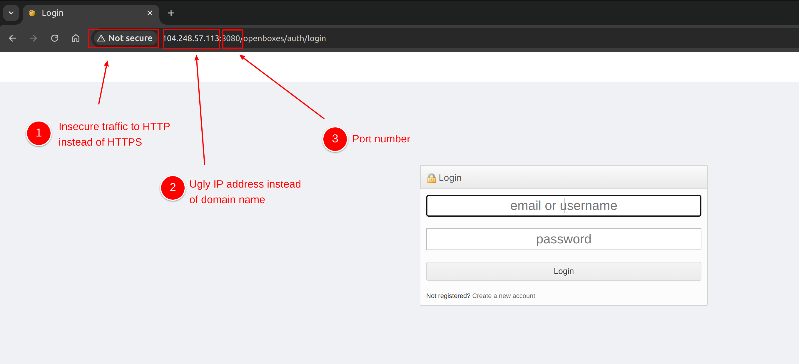

## The Problems
When we first connect to OpenBoxes, there are three glaringly obvious problems with our current
configuration (see screenshot below).

* Insecure traffic over HTTP
* IP address in the URL
* Port number in the URL

## The Solutions

The green checkmark indicates the recommended approach i.e. the one we have documented below. However,
you are free to choose the solution that works best for your situation.

### Port Number in URL
* [x] Install a web server (Nginx, Apache) to forward requests to Tomcat
* [ ] Configure Tomcat to listen on port 80/443 instead of 8080/8443
* [ ] Configure a load balancer to forward requests to Tomcat

### IP Address in URL
* [x] Register domain name with domain registrar
* [x] Create DNS record for new domain
* [x] Verify traffic is routed to server

### Insecure traffic over HTTP
* [x] Use Certbot (free)
    * [x] Install Certbot
    * [x] Configure web server (Nginx, Apache) to handle SSL termination
    * [x] Automate renewal of Certbot certificates
* [ ] Purchase an SSL certificate from a trusted certificate authority
    * [ ] Configure web server (Nginx, Apache) to handle SSL termination
    * [ ] Manually renew certification before expiration
