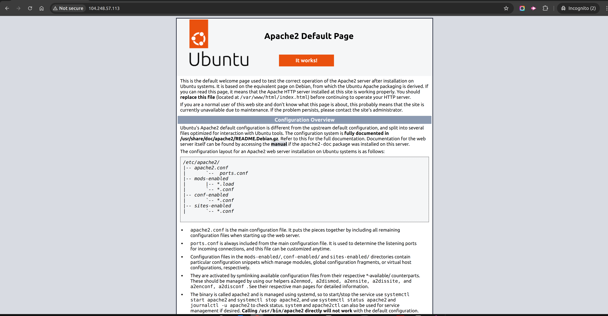

## Install proxy server dependency

For single-server deployments, we recommend using a proxy server to handle the HTTPS. If you are using
a multi-server deployment strategy (separate database + app server) then we might recommend using a load balancer
as the SSL terminus and proxy server since it will make the transition to a horizontally-scalable
deployment strategy more convenient.


=== "Apache"

    ```
    sudo apt install apache2
    ```

    After installing Apache, the apache2 service will automatically start up with a default 
    site configuration.

    !!! note 
        You should be able to see the Apache2 Default Page by entering your server's IP address 
        `http://<server-ip-address>` in the Browser search bar.

        


=== "nginx"

    ```
    sudo apt install nginx
    ```

## Enable reverse proxy configuration

The next step in the process is to configure the web server to act as a reverse proxy to
forward requests to Tomcat.

=== "Apache mod_proxy"

    There are multiple ways of doing this using Apache 2
    (mod_jk, mod_proxy, etc). Both solutions work, but we currently recommend mod_proxy.

    ### Enable modules 
    ```shell
    sudo a2enmod proxy proxy_http
    ```
    ### Restart Apache
    ```
    sudo systemctl restart apache2
    ```
    ### Configure mod_proxy
    Add the mod_proxy configuration to the default virtual host configuration file 
    (usually ``) at the end of the 
    `<VirtualHost *:80></VirtualHost>` config.

    ```title="etc/apache2/sites-available/000-default.conf" linenums="1"
    <VirtualHost *:80>
        ServerName example.com
        ... 

        # Redirect requests for root context to /openboxes
        RedirectMatch ^/$ /openboxes/
    
        # Forward /openboxes requests to Tomcat
        ProxyPreserveHost On
        ProxyPass /openboxes http://127.0.0.1:8080/openboxes
        ProxyPassReverse /openboxes http://127.0.0.1:8080/openboxes
    </VirtualHost>
    ```

    !!! note 
        Do NOT edit or remove anything at the top of this file unless 
        you are familiar with Apache configuration. Simply copy and paste
        lines 5-11 and paste them to the bottom of your config file, just inside
        the closing `</VirtualHost>` element.


    ### Test configuration  
    ```shell
    apachectl configtest
    ```
    
    !!! note
        At this point, you should see a "Syntax OK" message along with a warning about the ServerName (which I have safely ignored for over a decade). 
        ```
        AH00558: apache2: Could not reliably determine the server's fully qualified domain name, using 127.0.1.1. Set the 'ServerName' directive globally to suppress this message
        Syntax OK
        ```

    ### Restart Apache
    ```
    sudo service apache2 restart
    ```

=== "nginx"

    ### Create Nginx reverse proxy configuration using heredoc
    ```
    sudo bash -c 'cat <<-EOT > /etc/nginx/sites-available/reverse-proxy.conf
    server {
        listen 80;
    
        access_log /var/log/nginx/reverse-access.log;
        error_log /var/log/nginx/reverse-error.log;
    
        location / {
            proxy_set_header   X-Forwarded-For /$remote_addr;
            proxy_pass         "http://127.0.0.1:8080";
        }
    }
    EOT'
    ```
    
    ### Enable Nginx reverse proxy configuration
    ```
    sudo unlink /etc/nginx/sites-enabled/default
    sudo ln -s /etc/nginx/sites-available/reverse-proxy.conf /etc/nginx/sites-enabled/reverse-proxy.conf
    ```

    ### Restart nginx
    ```
    sudo service nginx restart
    ```
