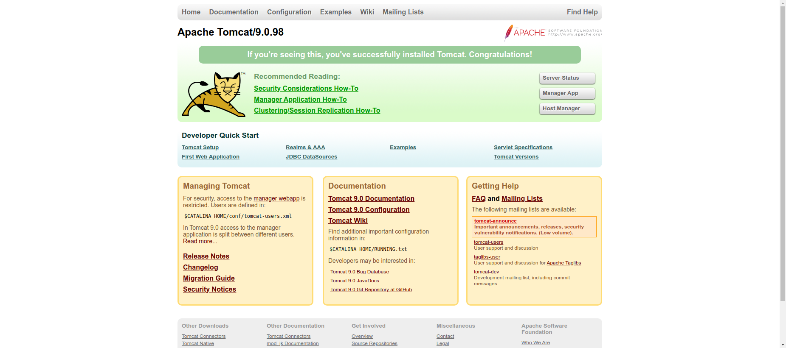

OpenBoxes currently depends on Java 8. Therefore, we need to install a version of Tomcat that has 
been compiled with Java 8. 

## Choose Installation Method


### Option 1: Install from APT repository (easiest)
The simplest way to install Tomcat 9 is to install the tomcat9 package from the APT repository. This 
is not the recommended approach, but should be sufficient for most users. 

```shell
sudo apt install tomcat9
```
!!! note "Important"
    The Tomcat 9 package available from the APT repository was compiled with Java 8, but has 
    dependencies that were compiled with a later version of Java. This causes incompatibility 
    issues for certain features, so we only recommend 
    this approach if you
    (a) are a novice with Ubuntu and Tomcat AND
    (b) don't plan to use more advanced features like the Tomcat Manager or CI/CD pipelines. 

    **TL;DR:** If you don't understand what you just read, then Option 1 is probably an ok option for you.

### Option 2: Install Manually (recommended)

#### Create user 
The first step in the process is to create a new Tomcat user that will execute all Tomcat processes.
```
sudo useradd -r -m -U -d /opt/tomcat -s /bin/false tomcat
```

#### Download latest version
Go to the [Tomcat Versions](https://tomcat.apache.org/whichversion.html) page, find the table 
named Currently Supported Versions and find the Latest Released Version for 9.0.x. 

At the time this document was published, the latest release was 9.0.106, so we'll use `wget` to
download the binary version of the Tomcat server using the following URL.
```shell
wget -c https://downloads.apache.org/tomcat/tomcat-9/v9.0.106/bin/apache-tomcat-9.0.106.tar.gz
```

#### Extract contents
Once the tar.gz file has been downloaded, we need to extract the contents onto the file system. 
This can be done using the following command. 
```shell
sudo tar xf apache-tomcat-9.0.106.tar.gz -C /opt
```
In addition, we need to change ownership of the Tomcat directory and make all scripts executable. 
```shell
sudo chmod +x /opt/apache-tomcat-9.0.106/bin/*.sh
```

#### Create symlink
In order to update Tomcat more easily in the future we recommend creating a symlink 

```shell
sudo ln -s /opt/apache-tomcat-9.0.106/ /opt/tomcat
```

## Configure Tomcat Service

### Determine Java Runtime path
Copy and paste the output. It will be used to replace `<PASTE_PATH_TO_JRE_HERE>` in tomcat.service.
```
readlink -f /etc/alternatives/java
```
For example, on the server we're using to write these instructions, the path looks like this 
```
/usr/lib/jvm/java-8-openjdk-amd64/jre/bin/java
```
Copy the path up to `/bin/java`. For example, `/usr/lib/jvm/java-8-openjdk-amd64/jre`.

### Create tomcat.service unit file
```
sudo vi /etc/systemd/system/tomcat.service
```
and copy the contents below into tomcat.service.
```title="/etc/systemd/system/tomcat.service"
[Unit]
Description=Apache Tomcat Web Application Container
After=network.target

[Service]
Type=forking

Environment=JAVA_HOME=<PASTE_PATH_TO_JRE_HERE>
Environment=CATALINA_PID=/opt/tomcat/temp/tomcat.pid
Environment=CATALINA_HOME=/opt/tomcat
Environment=CATALINA_BASE=/opt/tomcat
Environment='CATALINA_OPTS=-Xms1024m -Xmx1024m -XX:MaxPermSize=128m -server -XX:+UseParallelGC'
Environment='JAVA_OPTS=-Djava.awt.headless=true -Djava.security.egd=file:/dev/./urandom'

ExecStart=/opt/tomcat/bin/startup.sh
ExecStop=/opt/tomcat/bin/shutdown.sh

User=tomcat
Group=tomcat
UMask=0007
RestartSec=10
Restart=always

[Install]
WantedBy=multi-user.target
```

!!! note
    Quick note about the memory settings configured in tomcat.service. You will likely encounter 
    OutOfMemoryErrors with Tomcat's default memory settings. You may be able to get away with using 
    256m as the max heap size, but 512m is a sufficient default setting, even for production 
    environments. 

    If you followed our System Requirements and provisioned a VM with 4 GB of RAM then I would 
    recommend bumping min and max heap size to 2048m.


    
If you are in a limited memory environment (like an EC2 t2.micro which only has 1 GB of memory) you 
will need to reduce your memory settings a little further. 
```
Environment='CATALINA_OPTS=-Xms128m -Xmx256m -XX:MaxPermSize=128m -Djava.security.egd=file:/dev/./urandom -server -XX:+UseParallelGC'
```
Unfortunately, with so little memory allocated you will probably run into several types of OutOfMemoryError issues 
(see Troublshooting section below).

[//]: # (### Make Tomcat service executable)

[//]: # (```)

[//]: # (chmod +x /etc/systemd/system/tomcat.service)

[//]: # (```)
### Reload systemd Daemon Configuration
In order to make our new unit file available via systemd, we need to reload the systemd daemon
configuration using the following command.
```
sudo systemctl daemon-reload
```
### Start Tomcat service
```shell
sudo systemctl start tomcat
```

### Check Tomcat service status
Next you can check the status of the service to ensure that Tomcat has started.
```shell
sudo systemctl status tomcat
● tomcat.service - Apache Tomcat Web Application Container
     Loaded: loaded (/etc/systemd/system/tomcat.service; enabled; vendor preset: enabled)
     Active: active (running) since Sat 2025-01-18 05:07:35 UTC; 16min ago
    Process: 15049 ExecStart=/opt/tomcat/bin/startup.sh (code=exited, status=0/SUCCESS)
   Main PID: 15056 (java)
      Tasks: 28 (limit: 2310)
     Memory: 184.3M
        CPU: 11.891s
     CGroup: /system.slice/tomcat.service
             └─15056 /usr/lib/jvm/java-8-openjdk-amd64/jre/bin/java -Djava.util.logging.config.file=/opt/tomcat/conf/logging.properties -Djava.util.logging.manager=org.apache.juli.ClassLoaderLogManager -Djava.a>
```
You can also check the default Tomcat home page  
```
http://<virtual-machine-ip-address>:8080
```
which should render the following static HTML page.


### Enable Tomcat service
Now that the Tomcat service is starting as expected, we can enable the service so that is starts 
on system boot.
```
sudo systemctl enable tomcat
```
You should see the following message if the command was successful.
```console
Created symlink /etc/systemd/system/multi-user.target.wants/tomcat.service → /etc/systemd/system/tomcat.service.

```

### Configure Tomcat manager **(optional)**
If you want to be able to upload new releases of OpenBoxes automatically via a continuous 
deployment (CD) pipeline or manually though the web interface, you'll need to enable Tomcat manager.

This configuration can be used to make future upgrades through the Tomcat manager web interface. 
Make sure the file is only readable by the user that runs Tomcat. Replace <manager-gui-\*> and 
<manager-script-\*> with appropriate values. See Tomcat docs for more information 
(https://tomcat.apache.org/tomcat-9.0-doc/manager-howto.html#Configuring_Manager_Application_Access).

```title="/opt/tomcat/conf/tomcat-users.xml"
<tomcat-users>
  <role rolename="manager-gui"/>
  <role rolename="manager-script"/>
  <role rolename="manager-jmx"/>
  <role rolename="manager-status"/>
  <user username="<MANAGER-GUI-USERNAME>" password="<MANAGER-GUI-PASSWORD>" roles="manager-gui"/>
  <user username="<MANAGER-SCRIPT-USERNAME>" password="<MANAGE-SCRIPT-PASSWORD>" roles="manager-script"/>
</tomcat-users>
```

!!! warning "Important" 
    Please do NOT use obvious usernames and passwords (i.e. tomcat, password, s3cret, etc) because 
    your server will assuredly get exploited. And if you are running the Tomcat process as root, 
    


## Additional Information

### Systemctl commands

```shell
sudo systemctl status tomcat
sudo systemctl start tomcat
sudo systemctl stop tomcat
sudo systemctl restart tomcat
```
If you ever need to enable or disable the service you can use the following commands
```shell
sudo systemctl enable tomcat
sudo systemctl disable tomcat
```
If you need to enable/disable and simultaneously start/stop the service you can add the `--now` 
argument.
```shell
sudo systemctl enable tomcat --now
sudo systemctl disable tomcat --now
```

### Service commands
At this point I generally go back to using the Ubuntu's `service` wrapper which abstracts the 
underlying implementation (could be `/etc/init.d`, Upstart, or `systemctl`). But it's up to you 
whether you want to continue using `systemctl` or switch back to `service`.

Here are the commands available if using the `service` wrapper:
```
sudo service tomcat status
sudo service tomcat stop
sudo service tomcat start
sudo service tomcat restart
```


## Resources
* [https://www.digitalocean.com/community/tutorials/install-tomcat-on-linux](A Complete Guide to Install Tomcat on Linux)

