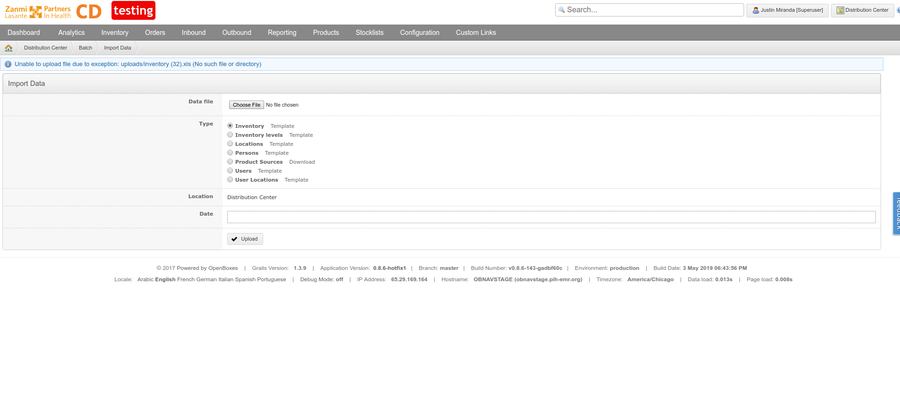

## Connection Pool

### Public Key Retrieval is not allowed

#### Cause
The exact cause is unknown, but this seems to be related to the fact that we're not connecting to the database via SSL.

#### Solution
The `dataSource.url` should include parameter `allowPublicKeyRetrieval=true`

#### Resources 
* [https://stackoverflow.com/questions/50379839/connection-java-mysql-public-key-retrieval-is-not-allowed](https://stackoverflow.com/questions/50379839/connection-java-mysql-public-key-retrieval-is-not-allowed)
* [https://knowledge.broadcom.com/external/article/259949/broadcom-api-gateway-mysql-jdbc-connecti.html](https://knowledge.broadcom.com/external/article/259949/broadcom-api-gateway-mysql-jdbc-connecti.html)

#### Stacktrace
```
[2024-08-09 03:56:10] [info] 2024-08-09 03:56:10,566 ERROR [-utility-2] o.apache.tomcat.jdbc.pool.ConnectionPool: Unable to create initial connections of pool.
[2024-08-09 03:56:10] [info] java.sql.SQLNonTransientConnectionException: Public Key Retrieval is not allowed
```
#### Alterantive stacktrace
```
[2024-08-09 03:56:23] [info] 2024-08-09 03:56:23,438  WARN [-utility-2] o.s.jdbc.support.SQLErrorCodesFactory   : Error while extracting database name - falling back to empty error codes
[2024-08-09 03:56:23] [info] org.springframework.jdbc.support.MetaDataAccessException: Error while extracting DatabaseMetaData; nested exception is java.sql.SQLNonTransientConnectionException: Public Key
Retrieval is not allowed
```

### Access denied for user 'openboxes'@'localhost' to database 'openboxes'

#### Cause 
There are potentially many causes to this error, but the most common are
* configuration file is not being found
* configuration file is found, but credentials are not correct

#### Solution
Make sure the configuration file is being loaded by the application and make sure the credentials provided
in the configuration file are 

```shell
mysql -u <dataSource.username> -p<dataSource.password> <database>
```

#### Stacktrace
```
[2024-08-09 04:04:31] [info] 2024-08-09 04:04:31,225 ERROR [main      ] o.apache.tomcat.jdbc.pool.ConnectionPool: Unable to create initial connections of pool.
[2024-08-09 04:04:31] [info] java.sql.SQLSyntaxErrorException: Access denied for user 'openboxes'@'localhost' to database 'obnav'
```

## Grails Initialization

### An illegal reflective access operation has occurred
#### Cause
TBD

#### Solution
TBD

#### Stacktrace 
```
[2024-08-09 04:03:48] [info] Deploying web application archive [/var/lib/tomcat9/webapps/openboxes.war]
[2024-08-09 04:03:49] [info] WARNING: An illegal reflective access operation has occurred
[2024-08-09 04:03:49] [info] WARNING: Illegal reflective access by org.codehaus.groovy.vmplugin.v7.Java7$1 (file:/var/lib/tomcat9/webapps/openboxes/WEB-INF/lib/groovy-2.4.21.jar) to constructor java.lang.
invoke.MethodHandles$Lookup(java.lang.Class,int)
[2024-08-09 04:03:49] [info] WARNING: Please consider reporting this to the maintainers of org.codehaus.groovy.vmplugin.v7.Java7$1
[2024-08-09 04:03:49] [info] WARNING: Use --illegal-access=warn to enable warnings of further illegal reflective access operations
[2024-08-09 04:03:49] [info] WARNING: All illegal access operations will be denied in a future release
```

### There are conflicting tags: [tag1] vs. [tag2]. The former will take precedence.

#### Cause
TBD

#### Solution
TBD

#### Stacktrace
```
[2024-08-09 03:55:58] [info] 2024-08-09 03:55:58,227  INFO [-utility-2] o.g.c.artefact.gsp.TagLibArtefactHandler: There are conflicting tags: org.pih.warehouse.DatePickerTagLib.g:datePicker vs. org.grails
.plugins.web.taglib.FormTagLib.g:datePicker. The former will take precedence.
[2024-08-09 03:55:58] [info] 2024-08-09 03:55:58,241  INFO [-utility-2] o.g.c.artefact.gsp.TagLibArtefactHandler: There are conflicting tags: org.pih.warehouse.DatePickerTagLib.g:datePicker vs. org.grails
.plugins.web.taglib.FormTagLib.g:datePicker. The former will take precedence.
```


### Unable to load specified config location 

#### Solution
While you need to make sure that one of these configuration file is loaded, you can ignore these errors because these files are only used to override the default `openboxes-config.properties`.
```
Using configuration locations [classpath:openboxes-config.properties, classpath:openboxes-config.groovy, file:/opt/tomcat/.grails/openboxes-config.properties, file:/opt/tomcat/.grails/openboxes-config.groovy] [production]
Unable to load specified config location classpath:openboxes-config.properties : class path resource [openboxes-config.properties] cannot be opened because it does not exist
Unable to load specified config location classpath:openboxes-config.groovy : class path resource [openboxes-config.groovy] cannot be opened because it does not exist
Unable to load specified config location file:/opt/tomcat/.grails/openboxes-config.groovy : /opt/tomcat/.grails/openboxes-config.groovy (No such file or directory)
```

However, if the log shows that the following file could not be found, then we might have a problem. Check that the 
file exists and that the ownership and permissions on this file allow the `tomcat` user to read it.
```
Unable to load specified config location file:/opt/tomcat/.grails/openboxes-config.properties : /opt/tomcat/.grails/openboxes-config.properties (No such file or directory)
```

## Java OutOfMemoryError
The following errors are related to the `-Xms` (min heap), `-Xmx` (max heap) , and `-XX:MaxPermSize=256m` 
(max perm gen space) memory settings. These errors indicate that the heap / permgen memory spaces are not allocated 
appropriately and/or there's a memory leak in the application. 

* Heap space (`OutOfMemoryError: Java heap space`)
* PermGen (`OutOfMemoryError: PermGen space`)

See [this article] (https://plumbr.eu/outofmemoryerror/java-heap-space) for a good description of the problem. 
Contact [support@openboxes.com](mailto:support@openboxes.com) if you have further questions.

## Out of Memory: Killed process 31088 (java)
In this case, the Linux kernel has killed your Tomcat instance because it over stepped the OS bounds on memory. At 
this point, you may have increased the max heap size as much as you can. This probably means you need to upgrade to a 
larger instance type (i.e. as we mentioned above, an instance type that has 2GB of memory is a good start).


## java.io.FileNotFoundException: stacktrace.log (Permission denied)
You can safely ignore this error. 
```
log4j:ERROR setFile(null,true) call failed.
java.io.FileNotFoundException: stacktrace.log (Permission denied)
	at java.io.FileOutputStream.open(Native Method)
	at java.io.FileOutputStream.<init>(FileOutputStream.java:221)
	at java.io.FileOutputStream.<init>(FileOutputStream.java:142)
	at org.apache.log4j.FileAppender.setFile(FileAppender.java:294)
	at org.apache.log4j.FileAppender.activateOptions(FileAppender.java:165)
	at org.apache.log4j.spi.OptionHandler$activateOptions.call(Unknown Source)
	at org.codehaus.groovy.runtime.callsite.CallSiteArray.defaultCall(CallSiteArray.java:40)
	at org.codehaus.groovy.runtime.callsite.AbstractCallSite.call(AbstractCallSite.java:116)
	at org.codehaus.groovy.runtime.callsite.AbstractCallSite.call(AbstractCallSite.java:120)
	at org.codehaus.groovy.grails.plugins.logging.Log4jConfig.createFullstackTraceAppender(Log4jConfig.groovy:177)
	at org.codehaus.groovy.grails.plugins.logging.Log4jConfig.this$2$createFullstackTraceAppender(Log4jConfig.groovy)
	at org.codehaus.groovy.grails.plugins.logging.Log4jConfig$this$2$createFullstackTraceAppender.callCurrent(Unknown Source)
	at org.codehaus.groovy.runtime.callsite.CallSiteArray.defaultCallCurrent(CallSiteArray.java:44)
	at org.codehaus.groovy.runtime.callsite.AbstractCallSite.callCurrent(AbstractCallSite.java:141)
	at org.codehaus.groovy.runtime.callsite.AbstractCallSite.callCurrent(AbstractCallSite.java:145)
	at org.codehaus.groovy.grails.plugins.logging.Log4jConfig.configure(Log4jConfig.groovy:145)
	at org.codehaus.groovy.grails.web.util.Log4jConfigListener.contextInitialized(Log4jConfigListener.java:62)
	at org.apache.catalina.core.StandardContext.listenerStart(StandardContext.java:5157)
	at org.apache.catalina.core.StandardContext.startInternal(StandardContext.java:5680)
	at org.apache.catalina.util.LifecycleBase.start(LifecycleBase.java:145)
	at org.apache.catalina.core.ContainerBase.addChildInternal(ContainerBase.java:1018)
	at org.apache.catalina.core.ContainerBase.addChild(ContainerBase.java:994)
	at org.apache.catalina.core.StandardHost.addChild(StandardHost.java:652)
	at org.apache.catalina.startup.HostConfig.deployWAR(HostConfig.java:1127)
	at org.apache.catalina.startup.HostConfig$DeployWar.run(HostConfig.java:2021)
	at java.util.concurrent.Executors$RunnableAdapter.call(Executors.java:473)
	at java.util.concurrent.FutureTask.run(FutureTask.java:262)
	at java.util.concurrent.ThreadPoolExecutor.runWorker(ThreadPoolExecutor.java:1152)
	at java.util.concurrent.ThreadPoolExecutor$Worker.run(ThreadPoolExecutor.java:622)
	at java.lang.Thread.run(Thread.java:748)
```

## Could not connect to SMTP host: localhost, port: 25;
By default, the system assumes that there's an SMTP server listening on port 25 so that it can send exceptions to
`errors@openboxes.com`. This should probably be disabled by default. For now you can just ignore these errors.
```
javax.mail.MessagingException: Could not connect to SMTP host: localhost, port: 25;
  nested exception is:
	java.net.ConnectException: Connection refused (Connection refused)
```

## MySQLSyntaxErrorException: Unknown column 'this_.created_by_id' in 'field list'

This is related to a bug / limitation with the Quartz scheduler. By default we can only limit the Quartz 
scheduler from starting tasks for up to X seconds. We cannot set dependencies such as 
"when the database has been created". Because of this limitation, the Quartz scheduler triggers all jobs during 
the application bootstrapping and before the database migrations have been completed. Therefore, some Quartz jobs
which depend on the database are executed before the database is ready. Hence the "Unknown column" errors.

Related issues:
* https://github.com/openboxes/openboxes/issues/26
* https://github.com/openboxes/openboxes/issues/259

```
Caused by: com.mysql.jdbc.exceptions.jdbc4.MySQLSyntaxErrorException: Unknown column 'this_.created_by_id' in 'field list'
	at sun.reflect.NativeConstructorAccessorImpl.newInstance0(Native Method)
	at sun.reflect.NativeConstructorAccessorImpl.newInstance(NativeConstructorAccessorImpl.java:57)
	at sun.reflect.DelegatingConstructorAccessorImpl.newInstance(DelegatingConstructorAccessorImpl.java:45)
	at java.lang.reflect.Constructor.newInstance(Constructor.java:526)
	at com.mysql.jdbc.Util.handleNewInstance(Util.java:411)
	at com.mysql.jdbc.Util.getInstance(Util.java:386)
	at com.mysql.jdbc.SQLError.createSQLException(SQLError.java:1054)
	at com.mysql.jdbc.MysqlIO.checkErrorPacket(MysqlIO.java:4190)
	at com.mysql.jdbc.MysqlIO.checkErrorPacket(MysqlIO.java:4122)
	at com.mysql.jdbc.MysqlIO.sendCommand(MysqlIO.java:2570)
	at com.mysql.jdbc.MysqlIO.sqlQueryDirect(MysqlIO.java:2731)
	at com.mysql.jdbc.ConnectionImpl.execSQL(ConnectionImpl.java:2818)
	at com.mysql.jdbc.PreparedStatement.executeInternal(PreparedStatement.java:2157)
	at com.mysql.jdbc.PreparedStatement.executeQuery(PreparedStatement.java:2324)
	at com.mchange.v2.c3p0.impl.NewProxyPreparedStatement.executeQuery(NewProxyPreparedStatement.java:76)
	at org.hibernate.jdbc.AbstractBatcher.getResultSet(AbstractBatcher.java:208)
	at org.hibernate.loader.Loader.getResultSet(Loader.java:1808)
	at org.hibernate.loader.Loader.doQuery(Loader.java:697)
	at org.hibernate.loader.Loader.doQueryAndInitializeNonLazyCollections(Loader.java:259)
	at org.hibernate.loader.Loader.doList(Loader.java:2228)
	... 75 more
```

Once the database migration process has completed you should stop seeing these errors and the logs will 
show that the deployment has completed successfully.

```
...
2018-11-16 18:11:25,783 [localhost-startStop-1] INFO  liquibase  - Release Database Lock
2018-11-16 18:11:25,784 [localhost-startStop-1] INFO  liquibase  - Successfully released change log lock
2018-11-16 18:11:26,583 [localhost-startStop-1] INFO  bootstrap.BootStrap  - Finished running liquibase changelog(s)!
2018-11-16 18:11:26,584 [localhost-startStop-1] INFO  bootstrap.BootStrap  - Insert test fixtures?  true
2018-11-16 18:11:26,585 [localhost-startStop-1] INFO  bootstrap.BootStrap  - Inserting test fixtures ...
2018-11-16 18:11:26,598 [localhost-startStop-1] INFO  bootstrap.BootStrap  - Creating uploads directory if it doesn't already exist
2018-11-16 18:11:26,598 [localhost-startStop-1] INFO  context.ContextLoader  - Root WebApplicationContext: initialization completed in 523311 ms
Nov 16, 2018 6:11:26 PM org.apache.catalina.startup.HostConfig deployWAR
INFO: Deployment of web application archive /opt/tomcat/apache-tomcat-7.0.91/webapps/openboxes.war has finished in 545,140 ms
Nov 16, 2018 6:11:27 PM org.apache.coyote.AbstractProtocol start
INFO: Starting ProtocolHandler ["http-bio-8080"]
Nov 16, 2018 6:11:27 PM org.apache.coyote.AbstractProtocol start
INFO: Starting ProtocolHandler ["ajp-bio-8009"]
Nov 16, 2018 6:11:27 PM org.apache.catalina.startup.Catalina start
INFO: Server startup in 546085 ms
```

### Uploads directory does not exist

#### Cause
It is unclear why this directory is not created during the startup process.

#### Solution 
Create an `uploads` directory under Tomcat root directory.
```
sudo mkdir /var/lib/tomcat9/uploads
sudo chown tomcat:tomcat /var/lib/tomcat9/uploads
```

There are times when this may not resolve the issue (particularly when you install Tomcat from scatch like we've done
here in these instructions). We're still looking into this bug, but in case you get the same error even after creating the
`uploads` directory under Tomcat, consider creating it under the root (/) directory.
```
sudo mkdir /uploads
sudo chown tomcat:tomcat /uploads
```

#### Stracktrace
```
Unable to upload file due to exception: uploads/inventory (32).xls (No such file or directory)
```



### java.util.zip.ZipException: zip END header not found

#### Cause This error occurs when you attempt to download the openboxes.war file while the Tomcat instance is running. 

#### Solution  
RTFM. Following the instructions will prompt you to stop the Tomcat instance before proceeding 
with the deployment.

#### Stacktrace
```
[2024-08-09 03:55:26] [info] Deploying web application archive [/var/lib/tomcat9/webapps/openboxes.war]
[2024-08-09 03:55:26] [crit] Exception fixing docBase for context [/openboxes]
[2024-08-09 03:55:26] [crit] java.util.zip.ZipException: zip END header not found
[2024-08-09 03:55:26] [crit]     at java.base/java.util.zip.ZipFile$Source.zerror(ZipFile.java:1776)
[2024-08-09 03:55:26] [crit]     at java.base/java.util.zip.ZipFile$Source.findEND(ZipFile.java:1659)
[2024-08-09 03:55:26] [crit]     at java.base/java.util.zip.ZipFile$Source.initCEN(ZipFile.java:1666)
[2024-08-09 03:55:26] [crit]     at java.base/java.util.zip.ZipFile$Source.<init>(ZipFile.java:1470)
[2024-08-09 03:55:26] [crit]     at java.base/java.util.zip.ZipFile$Source.get(ZipFile.java:1433)
[2024-08-09 03:55:26] [crit]     at java.base/java.util.zip.ZipFile$CleanableResource.<init>(ZipFile.java:841)
[2024-08-09 03:55:26] [crit]     at java.base/java.util.zip.ZipFile$CleanableResource$FinalizableResource.<init>(ZipFile.java:867)
[2024-08-09 03:55:26] [crit]     at java.base/java.util.zip.ZipFile$CleanableResource.get(ZipFile.java:856)
[2024-08-09 03:55:26] [crit]     at java.base/java.util.zip.ZipFile.<init>(ZipFile.java:258)
[2024-08-09 03:55:26] [crit]     at java.base/java.util.zip.ZipFile.<init>(ZipFile.java:187)
[2024-08-09 03:55:26] [crit]     at java.base/java.util.jar.JarFile.<init>(JarFile.java:348)
[2024-08-09 03:55:26] [crit]     at java.base/sun.net.www.protocol.jar.URLJarFile.<init>(URLJarFile.java:103)
[2024-08-09 03:55:26] [crit]     at java.base/sun.net.www.protocol.jar.URLJarFile.getJarFile(URLJarFile.java:72)
[2024-08-09 03:55:26] [crit]     at java.base/sun.net.www.protocol.jar.JarFileFactory.get(JarFileFactory.java:99)
[2024-08-09 03:55:26] [crit]     at java.base/sun.net.www.protocol.jar.JarURLConnection.connect(JarURLConnection.java:125)
[2024-08-09 03:55:26] [crit]     at java.base/sun.net.www.protocol.jar.JarURLConnection.getJarFile(JarURLConnection.java:92)
[2024-08-09 03:55:26] [crit]     at org.apache.catalina.startup.ExpandWar.expand(ExpandWar.java:128)
[2024-08-09 03:55:26] [crit]     at org.apache.catalina.startup.ContextConfig.fixDocBase(ContextConfig.java:820)
[2024-08-09 03:55:26] [crit]     at org.apache.catalina.startup.ContextConfig.beforeStart(ContextConfig.java:959)
[2024-08-09 03:55:26] [crit]     at org.apache.catalina.startup.ContextConfig.lifecycleEvent(ContextConfig.java:305)
[2024-08-09 03:55:26] [crit]     at org.apache.catalina.util.LifecycleBase.fireLifecycleEvent(LifecycleBase.java:123)
[2024-08-09 03:55:26] [crit]     at org.apache.catalina.util.LifecycleBase.setStateInternal(LifecycleBase.java:423)
[2024-08-09 03:55:26] [crit]     at org.apache.catalina.util.LifecycleBase.start(LifecycleBase.java:182)
[2024-08-09 03:55:26] [crit]     at org.apache.catalina.core.ContainerBase.addChildInternal(ContainerBase.java:726)
[2024-08-09 03:55:26] [crit]     at org.apache.catalina.core.ContainerBase.addChild(ContainerBase.java:698)
[2024-08-09 03:55:26] [crit]     at org.apache.catalina.core.StandardHost.addChild(StandardHost.java:696)
[2024-08-09 03:55:26] [crit]     at org.apache.catalina.startup.HostConfig.deployWAR(HostConfig.java:1024)
[2024-08-09 03:55:26] [crit]     at org.apache.catalina.startup.HostConfig$DeployWar.run(HostConfig.java:1911)
[2024-08-09 03:55:26] [crit]     at java.base/java.util.concurrent.Executors$RunnableAdapter.call(Executors.java:515)
[2024-08-09 03:55:26] [crit]     at java.base/java.util.concurrent.FutureTask.run(FutureTask.java:264)
[2024-08-09 03:55:26] [crit]     at org.apache.tomcat.util.threads.InlineExecutorService.execute(InlineExecutorService.java:75)
[2024-08-09 03:55:26] [crit]     at java.base/java.util.concurrent.AbstractExecutorService.submit(AbstractExecutorService.java:118)
[2024-08-09 03:55:26] [crit]     at org.apache.catalina.startup.HostConfig.deployWARs(HostConfig.java:825)
[2024-08-09 03:55:26] [crit]     at org.apache.catalina.startup.HostConfig.deployApps(HostConfig.java:475)
[2024-08-09 03:55:26] [crit]     at org.apache.catalina.startup.HostConfig.check(HostConfig.java:1667)
[2024-08-09 03:55:26] [crit]     at org.apache.catalina.startup.HostConfig.lifecycleEvent(HostConfig.java:315)
[2024-08-09 03:55:26] [crit]     at org.apache.catalina.util.LifecycleBase.fireLifecycleEvent(LifecycleBase.java:123)
[2024-08-09 03:55:26] [crit]     at org.apache.catalina.core.ContainerBase.backgroundProcess(ContainerBase.java:1162)
[2024-08-09 03:55:26] [crit]     at org.apache.catalina.core.ContainerBase$ContainerBackgroundProcessor.processChildren(ContainerBase.java:1365)
[2024-08-09 03:55:26] [crit]     at org.apache.catalina.core.ContainerBase$ContainerBackgroundProcessor.processChildren(ContainerBase.java:1369)
[2024-08-09 03:55:26] [crit]     at org.apache.catalina.core.ContainerBase$ContainerBackgroundProcessor.run(ContainerBase.java:1347)
[2024-08-09 03:55:26] [crit]     at java.base/java.util.concurrent.Executors$RunnableAdapter.call(Executors.java:515)
[2024-08-09 03:55:26] [crit]     at java.base/java.util.concurrent.FutureTask.runAndReset(FutureTask.java:305)
[2024-08-09 03:55:26] [crit]     at java.base/java.util.concurrent.ScheduledThreadPoolExecutor$ScheduledFutureTask.run(ScheduledThreadPoolExecutor.java:305)
[2024-08-09 03:55:26] [crit]     at java.base/java.util.concurrent.ThreadPoolExecutor.runWorker(ThreadPoolExecutor.java:1128)
[2024-08-09 03:55:26] [crit]     at java.base/java.util.concurrent.ThreadPoolExecutor$Worker.run(ThreadPoolExecutor.java:628)
[2024-08-09 03:55:26] [crit]     at org.apache.tomcat.util.threads.TaskThread$WrappingRunnable.run(TaskThread.java:61)
[2024-08-09 03:55:26] [crit]     at java.base/java.lang.Thread.run(Thread.java:829)
[2024-08-09 03:55:26] [crit] Error deploying web application archive [/var/lib/tomcat9/webapps/openboxes.war]
```

## Unable to add the resource at [filename] to the cache for web application [/openboxes] ...

### Cause
Unknown 

### Solution
Unknown

### Stacktrace
```
[2024-08-09 03:55:40] [warning] Unable to add the resource at [/WEB-INF/classes/extensions/symmetricds/insert-symmetric-triggers.sql] to the cache for web application [/openboxes] because there was insuff
icient free space available after evicting expired cache entries - consider increasing the maximum size of the cache
[2024-08-09 03:55:40] [warning] Unable to add the resource at [/WEB-INF/classes/goodsReceiptNote/_header.gsp] to the cache for web application [/openboxes] because there was insufficient free space availa
ble after evicting expired cache entries - consider increasing the maximum size of the cache
[2024-08-09 03:55:40] [warning] Unable to add the resource at [/WEB-INF/classes/goodsReceiptNote/print.gsp] to the cache for web application [/openboxes] because there was insufficient free space availabl
e after evicting expired cache entries - consider increasing the maximum size of the cache
[2024-08-09 03:55:40] [warning] Unable to add the resource at [/WEB-INF/classes/goodsReceiptNote/_body.gsp] to the cache for web application [/openboxes] because there was insufficient free space availabl
e after evicting expired cache entries - consider increasing the maximum size of the cache
[2024-08-09 03:55:40] [warning] Unable to add the resource at [/WEB-INF/classes/admin/index.gsp] to the cache for web application [/openboxes] because there was insufficient free space available after evi
cting expired cache entries - consider increasing the maximum size of the cache
```

### Could not create serializers for grailsTemplatesCache

#### Cause
Unknown 

#### Solution 
Ignore

#### Stacktrace
```
[2024-08-09 04:07:37] [info] 2024-08-09 04:07:37,499 DEBUG [main      ] org.ehcache.core.EhcacheManager         : Creating Cache 'grailsTemplatesCache' in EhcacheManager.
[2024-08-09 04:07:37] [info] 2024-08-09 04:07:37,500 DEBUG [main      ] org.ehcache.core.EhcacheManager         : Could not create serializers for grailsTemplatesCache
[2024-08-09 04:07:37] [info] org.ehcache.spi.serialization.UnsupportedTypeException: No serializer found for type 'java.lang.Object'
...
[2024-08-09 04:07:37] [info] 2024-08-09 04:07:37,504 DEBUG [main      ] o.e.i.i.spi.copy.DefaultCopyProvider    : Copier for <java.lang.Object> : org.ehcache.impl.copy.IdentityCopier@32aa6ade
[2024-08-09 04:07:37] [info] 2024-08-09 04:07:37,504 DEBUG [main      ] o.e.i.i.spi.copy.DefaultCopyProvider    : Copier for <java.lang.Object> : org.ehcache.impl.copy.IdentityCopier@3411f24
[2024-08-09 04:07:37] [info] 2024-08-09 04:07:37,513 DEBUG [main      ] c.e.core.Ehcache-grailsTemplatesCache   : Initialize successful.
[2024-08-09 04:07:37] [info] 2024-08-09 04:07:37,513  INFO [main      ] org.ehcache.core.EhcacheManager         : Cache 'grailsTemplatesCache' created in EhcacheManager.
```

### Could not create serializers for grailsBlocksCache

#### Cause
Unknown 

#### Solution 
Ignore 

#### Stacktrace
```
[2024-08-09 04:07:36] [info] 2024-08-09 04:07:36,553  INFO [main      ] o.s.j.e.a.AnnotationMBeanExporter       : Registering beans for JMX exposure on startup
[2024-08-09 04:07:36] [info] 2024-08-09 04:07:36,579  INFO [main      ] o.g.p.d.TomcatJDBCPoolMBeanExporter     : Registering beans for JMX exposure on startup
[2024-08-09 04:07:37] [info] 2024-08-09 04:07:37,290 DEBUG [main      ] a.pipeline.fs.FileSystemAssetResolver   : Asset Pipeline FSResolver Initialized with Scan Directories: []
[2024-08-09 04:07:37] [info] 2024-08-09 04:07:37,321 DEBUG [main      ] org.ehcache.core.EhcacheManager         : Creating Cache 'grailsBlocksCache' in EhcacheManager.
[2024-08-09 04:07:37] [info] 2024-08-09 04:07:37,328 DEBUG [main      ] org.ehcache.core.EhcacheManager         : Could not create serializers for grailsBlocksCache
[2024-08-09 04:07:37] [info] org.ehcache.spi.serialization.UnsupportedTypeException: No serializer found for type 'java.lang.Object'
...
[2024-08-09 04:07:37] [info] 2024-08-09 04:07:37,490  INFO [main      ] org.ehcache.core.EhcacheManager         : Cache 'grailsBlocksCache' created in EhcacheManager.

```

### Error parsing HTTP request header

#### Cause
TBD

#### Solution
TBD

#### Stacktrace
```
[2024-08-09 04:13:01] [info] Error parsing HTTP request header
[2024-08-09 04:13:01] [info]  Note: further occurrences of HTTP request parsing errors will be logged at DEBUG level.
[2024-08-09 04:13:01] [info] java.lang.IllegalArgumentException: Invalid character found in method name [0x160x030x010x060xa00x010x000x060x9c0x030x03=0x08H0xda0x9bK0xd40xd780xe7-ZhVQ0x190xbd0xb40x1a0x860x
daP0xfb0x840x840x0f0x890x100x00b0x9b0xf8 ]. HTTP method names must be tokens
[2024-08-09 04:13:01] [info]     at org.apache.coyote.http11.Http11InputBuffer.parseRequestLine(Http11InputBuffer.java:419)
[2024-08-09 04:13:01] [info]     at org.apache.coyote.http11.Http11Processor.service(Http11Processor.java:271)
[2024-08-09 04:13:01] [info]     at org.apache.coyote.AbstractProcessorLight.process(AbstractProcessorLight.java:65)
[2024-08-09 04:13:01] [info]     at org.apache.coyote.AbstractProtocol$ConnectionHandler.process(AbstractProtocol.java:889)
[2024-08-09 04:13:01] [info]     at org.apache.tomcat.util.net.NioEndpoint$SocketProcessor.doRun(NioEndpoint.java:1735)
[2024-08-09 04:13:01] [info]     at org.apache.tomcat.util.net.SocketProcessorBase.run(SocketProcessorBase.java:49)
[2024-08-09 04:13:01] [info]     at org.apache.tomcat.util.threads.ThreadPoolExecutor.runWorker(ThreadPoolExecutor.java:1191)
[2024-08-09 04:13:01] [info]     at org.apache.tomcat.util.threads.ThreadPoolExecutor$Worker.run(ThreadPoolExecutor.java:659)
[2024-08-09 04:13:01] [info]     at org.apache.tomcat.util.threads.TaskThread$WrappingRunnable.run(TaskThread.java:61)
[2024-08-09 04:13:01] [info]     at java.base/java.lang.Thread.run(Thread.java:829)
```


### java.sql.SQLException: Java heap space

#### Cause
TBD

#### Solution 
While we're not sure of the cause of this Java heap space error, if you encounter this particular error (it happens when 
refreshing product availability during startup) it's probably safe to increase the heap space setting in the Tomcat 
configuration.

#### Stacktrace 
```
2024-08-16 11:15:54,444 DEBUG [r_Worker-3] org.pih.warehouse.jobs.GparsService     : finished draining pool 'RefreshAllProducts'
2024-08-16 11:15:54,445 DEBUG [r_Worker-3] o.s.t.support.TransactionTemplate       : Initiating transaction rollback on application exception
org.springframework.jdbc.UncategorizedSQLException: Hibernate operation: could not extract ResultSet; uncategorized SQLException for SQL [n/a]; SQL state [HY001]; error code [0]; Java heap space; nested exception is java.sql.SQLException: Java heap space
        at org.springframework.jdbc.support.AbstractFallbackSQLExceptionTranslator.translate(AbstractFallbackSQLExceptionTranslator.java:90)
        at org.springframework.jdbc.support.AbstractFallbackSQLExceptionTranslator.translate(AbstractFallbackSQLExceptionTranslator.java:82)
        at org.springframework.jdbc.support.AbstractFallbackSQLExceptionTranslator.translate(AbstractFallbackSQLExceptionTranslator.java:82)
        at org.grails.orm.hibernate.GrailsHibernateTemplate.convertJdbcAccessException(GrailsHibernateTemplate.java:731)
        at org.grails.orm.hibernate.GrailsHibernateTemplate.convertHibernateAccessException(GrailsHibernateTemplate.java:719)
        at org.grails.orm.hibernate.GrailsHibernateTemplate.doExecute(GrailsHibernateTemplate.java:303)
        at org.grails.orm.hibernate.GrailsHibernateTemplate.get(GrailsHibernateTemplate.java:366)
        at org.grails.orm.hibernate.AbstractHibernateGormStaticApi.get(AbstractHibernateGormStaticApi.groovy:96)
        at org.grails.datastore.gorm.GormEntity$Trait$Helper.get(GormEntity.groovy:551)
        at org.grails.datastore.gorm.GormEntity$Trait$Helper$get$9.call(Unknown Source)
        at org.pih.warehouse.core.Location.get(Location.groovy)
        at org.pih.warehouse.core.Location$get$2.call(Unknown Source)
        at org.pih.warehouse.inventory.ProductAvailabilityService$__tt__refreshProductAvailability_closure57$_closure96.doCall(ProductAvailabilityService.groovy:129)
        at sun.reflect.GeneratedMethodAccessor350.invoke(Unknown Source)
        at sun.reflect.DelegatingMethodAccessorImpl.invoke(DelegatingMethodAccessorImpl.java:43)
        at java.lang.reflect.Method.invoke(Method.java:498)
        at org.springsource.loaded.ri.ReflectiveInterceptor.jlrMethodInvoke(ReflectiveInterceptor.java:1427)
        at org.codehaus.groovy.reflection.CachedMethod.invoke(CachedMethod.java:98)
        at groovy.lang.MetaMethod.doMethodInvoke(MetaMethod.java:325)
        at org.codehaus.groovy.runtime.metaclass.ClosureMetaClass.invokeMethod(ClosureMetaClass.java:264)
        at groovy.lang.MetaClassImpl.invokeMethod(MetaClassImpl.java:1034)
        at org.codehaus.groovy.runtime.callsite.PogoMetaClassSite.call(PogoMetaClassSite.java:41)
        at org.codehaus.groovy.runtime.callsite.AbstractCallSite.call(AbstractCallSite.java:128)
        at groovyx.gpars.pa.GParsPoolUtilHelper$_eachParallelPA_closure8.doCall(GParsPoolUtilHelper.groovy:192)
        at sun.reflect.GeneratedMethodAccessor348.invoke(Unknown Source)
        at sun.reflect.DelegatingMethodAccessorImpl.invoke(DelegatingMethodAccessorImpl.java:43)
        at java.lang.reflect.Method.invoke(Method.java:498)
        at org.springsource.loaded.ri.ReflectiveInterceptor.jlrMethodInvoke(ReflectiveInterceptor.java:1427)
        at org.codehaus.groovy.reflection.CachedMethod.invoke(CachedMethod.java:98)
        at groovy.lang.MetaMethod.doMethodInvoke(MetaMethod.java:325)
        at org.codehaus.groovy.runtime.metaclass.ClosureMetaClass.invokeMethod(ClosureMetaClass.java:264)
        at groovy.lang.MetaClassImpl.invokeMethod(MetaClassImpl.java:1034)
        at groovy.lang.Closure.call(Closure.java:420)
        at org.codehaus.groovy.runtime.ConvertedClosure.invokeCustom(ConvertedClosure.java:54)
        at org.codehaus.groovy.runtime.ConversionHandler.invoke(ConversionHandler.java:124)
        at com.sun.proxy.$Proxy130.op(Unknown Source)
        at groovyx.gpars.extra166y.AbstractParallelAnyArray$OUPap.leafApply(AbstractParallelAnyArray.java:640)
        at groovyx.gpars.extra166y.PAS$FJOApply.atLeaf(PAS.java:147)
        at groovyx.gpars.extra166y.PAS$FJBase.internalCompute(PAS.java:118)
        at groovyx.gpars.extra166y.PAS$FJBase.compute(PAS.java:106)
        at jsr166y.RecursiveAction.exec(RecursiveAction.java:148)
        at jsr166y.ForkJoinTask.doExec(ForkJoinTask.java:305)
        at jsr166y.ForkJoinWorkerThread.execTask(ForkJoinWorkerThread.java:575)
        at jsr166y.ForkJoinPool.scan(ForkJoinPool.java:733)
        at jsr166y.ForkJoinPool.work(ForkJoinPool.java:617)
        at jsr166y.ForkJoinWorkerThread.run(ForkJoinWorkerThread.java:369)
Caused by: java.sql.SQLException: Java heap space
        at com.mysql.cj.jdbc.exceptions.SQLError.createSQLException(SQLError.java:129)
        at com.mysql.cj.jdbc.exceptions.SQLError.createSQLException(SQLError.java:97)
        at com.mysql.cj.jdbc.exceptions.SQLExceptionsMapping.translateException(SQLExceptionsMapping.java:122)
        at com.mysql.cj.jdbc.ClientPreparedStatement.executeInternal(ClientPreparedStatement.java:953)
        at com.mysql.cj.jdbc.ClientPreparedStatement.executeQuery(ClientPreparedStatement.java:1003)
        at sun.reflect.GeneratedMethodAccessor331.invoke(Unknown Source)
        at sun.reflect.DelegatingMethodAccessorImpl.invoke(DelegatingMethodAccessorImpl.java:43)
        at java.lang.reflect.Method.invoke(Method.java:498)
        at org.springsource.loaded.ri.ReflectiveInterceptor.jlrMethodInvoke(ReflectiveInterceptor.java:1427)
        at org.apache.tomcat.jdbc.pool.interceptor.StatementDecoratorInterceptor$StatementProxy.invoke(StatementDecoratorInterceptor.java:238)
        at com.sun.proxy.$Proxy128.executeQuery(Unknown Source)
        at sun.reflect.GeneratedMethodAccessor331.invoke(Unknown Source)
        at sun.reflect.DelegatingMethodAccessorImpl.invoke(DelegatingMethodAccessorImpl.java:43)
        at java.lang.reflect.Method.invoke(Method.java:498)
        at org.springsource.loaded.ri.ReflectiveInterceptor.jlrMethodInvoke(ReflectiveInterceptor.java:1427)
        at org.apache.tomcat.jdbc.pool.StatementFacade$StatementProxy.invoke(StatementFacade.java:118)
        at com.sun.proxy.$Proxy128.executeQuery(Unknown Source)
        at org.hibernate.engine.jdbc.internal.ResultSetReturnImpl.extract(ResultSetReturnImpl.java:60)
        at org.hibernate.loader.plan.exec.internal.AbstractLoadPlanBasedLoader.getResultSet(AbstractLoadPlanBasedLoader.java:419)
        at org.hibernate.loader.plan.exec.internal.AbstractLoadPlanBasedLoader.executeQueryStatement(AbstractLoadPlanBasedLoader.java:191)
        at org.hibernate.loader.plan.exec.internal.AbstractLoadPlanBasedLoader.executeLoad(AbstractLoadPlanBasedLoader.java:121)
        at org.hibernate.loader.plan.exec.internal.AbstractLoadPlanBasedLoader.executeLoad(AbstractLoadPlanBasedLoader.java:86)
        at org.hibernate.loader.entity.plan.AbstractLoadPlanBasedEntityLoader.load(AbstractLoadPlanBasedEntityLoader.java:185)
        at org.hibernate.persister.entity.AbstractEntityPersister.load(AbstractEntityPersister.java:4121)
        at org.hibernate.event.internal.DefaultLoadEventListener.loadFromDatasource(DefaultLoadEventListener.java:508)
        at org.hibernate.event.internal.DefaultLoadEventListener.doLoad(DefaultLoadEventListener.java:478)
        at org.hibernate.event.internal.DefaultLoadEventListener.load(DefaultLoadEventListener.java:219)
        at org.hibernate.event.internal.DefaultLoadEventListener.proxyOrLoad(DefaultLoadEventListener.java:278)
        at org.hibernate.event.internal.DefaultLoadEventListener.doOnLoad(DefaultLoadEventListener.java:121)
        at org.hibernate.event.internal.DefaultLoadEventListener.onLoad(DefaultLoadEventListener.java:89)
        at org.hibernate.internal.SessionImpl.fireLoad(SessionImpl.java:1240)
        at org.hibernate.internal.SessionImpl.access$1900(SessionImpl.java:204)
        at org.hibernate.internal.SessionImpl$IdentifierLoadAccessImpl.doLoad(SessionImpl.java:2842)
        at org.hibernate.internal.SessionImpl$IdentifierLoadAccessImpl.load(SessionImpl.java:2816)
        at org.hibernate.internal.SessionImpl.get(SessionImpl.java:1076)
        at org.grails.orm.hibernate.GrailsHibernateTemplate$2.doInHibernate(GrailsHibernateTemplate.java:369)
        at org.grails.orm.hibernate.GrailsHibernateTemplate.doExecute(GrailsHibernateTemplate.java:299)
        ... 40 common frames omitted
```
