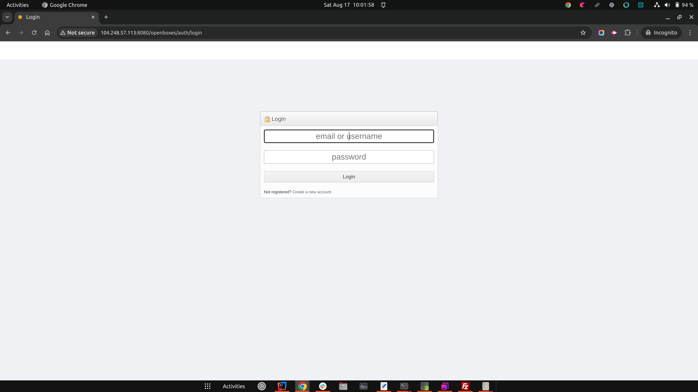
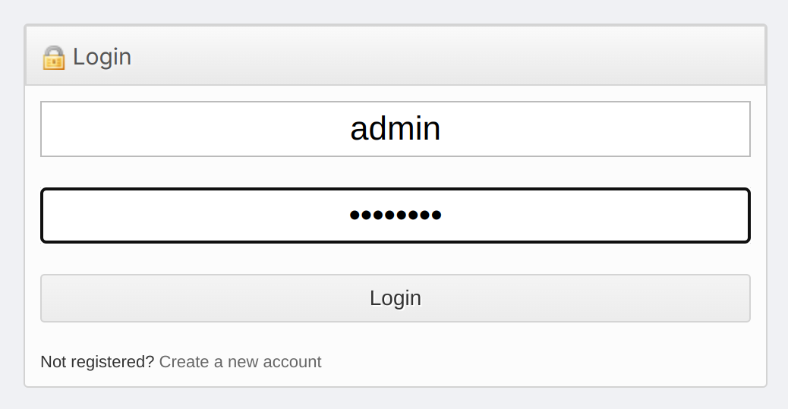
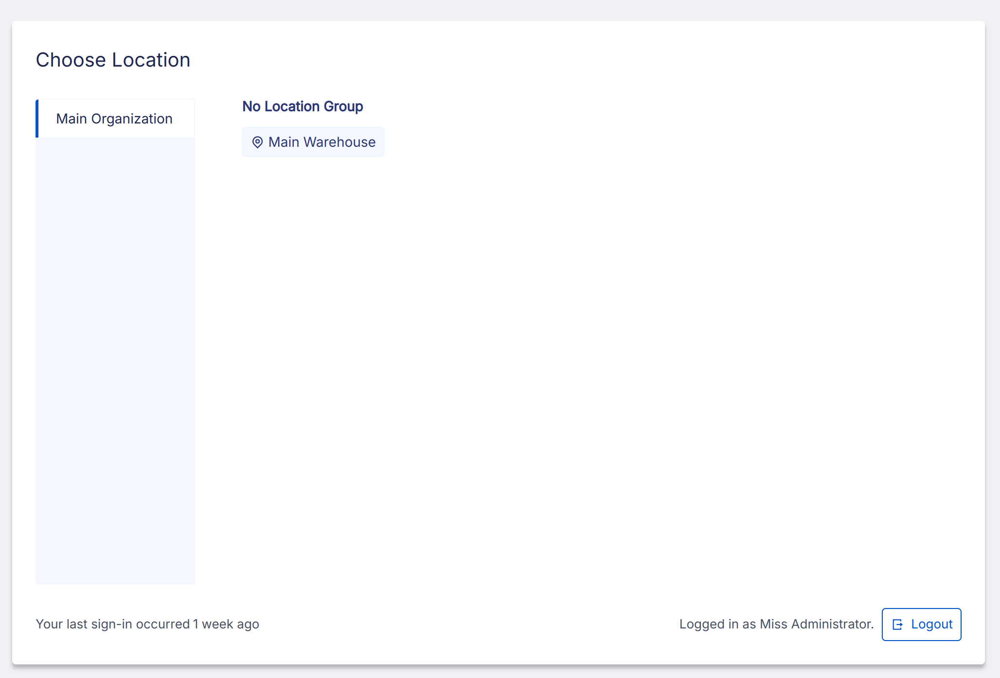
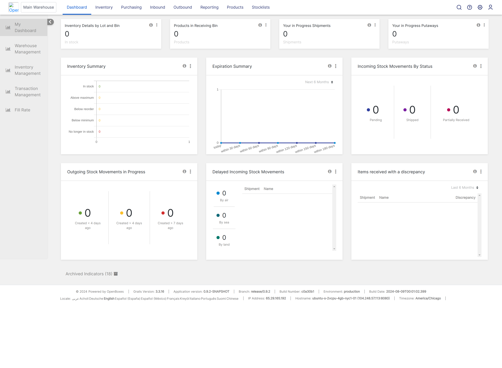

## Instructions

### Step 1. Navigate to OpenBoxes

Enter your server address in the URL 

    http://<server-ip>/openboxes

The system should prompt you for authentication credentials

### Step 2. Authenticate 

Enter the default credentails username `admin`, password `password`

### Step 3. Choose Location

Click the Main Warehouse button. 

The system should redirect you to the Dashboard.

### Step 4. Celebrate

