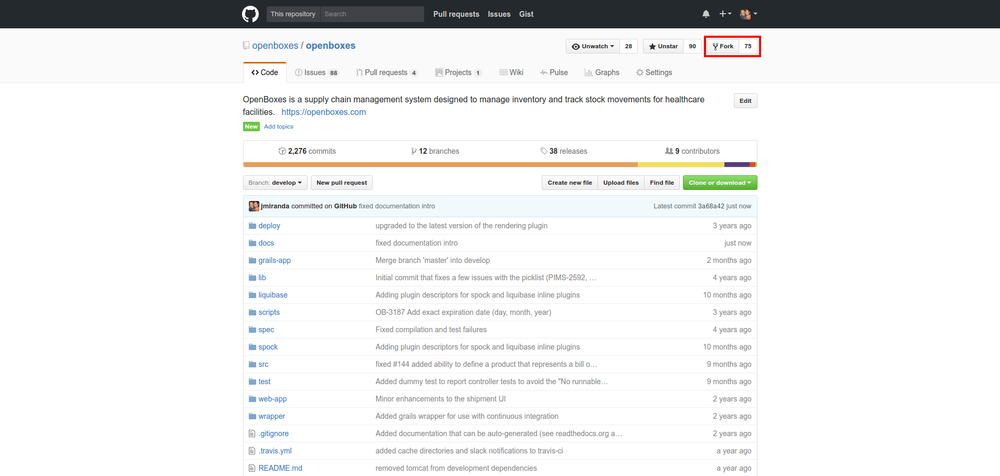

# Contributing
There are many ways to contribute to OpenBoxes, and not just through making changes to the source code. 
Here are a few examples of areas we need a considerable amount of help.

* Develop a new feature 
* Patch a bug / hotfix 
* Improve translations 
* Improve documentation
* Write unit, integration, functional tests

## Resources
* [GitHub Guide on Forking](https://guides.github.com/activities/forking/)

## Procedure

1. Find or create an issue for the feature or bug in [GitHub Issues.](https://github.com/openboxes/openboxes/issues)

1. Fork the [openboxes/openboxes](https://github.com/openboxes/openboxes) GitHub repository. 

1. Create a branch for your changes (create a `hotfix` for bugs if working off `master` or a `feature` branch for 
features if working off `develop`). **NOTE:** The use of the `hotfix` or `develop` prefix will help us identify which 
branch we need to merge your changes into. 
 
        git checkout -b hotfix/123-short-summary-of-issue
        git checkout -b feature/123-short-summary-of-issue

1. Implement your feature or hotfix in your new branch.

1. Write a test for your changes (if you have trouble with this step please comment in your ticket that you'd like some help). **NOTE:** Tests are required for features and bug fixes, but not for documentation and translation changes.

1. Run tests. 
        
        grails test-app unit:
        grails test-app integration:

1. Commit your changes 

        git commit -m "Implemented feature #123"

1. Push to your fork.

        git push 
        
1. Submit a pull request.

