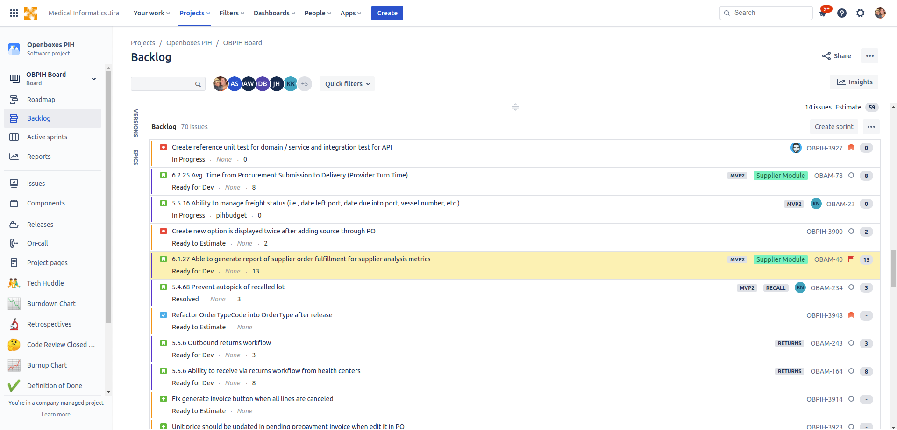

During the development of your release, you will break your Release Backlog into multiple sprints.
We start a new sprint every two (2) weeks. The sprint start and end is on Wednesdays. The number
of sprints that are required to complete a new release is based on the number of tickets (stories)
and the velocity of the development team (number of stories / story points) completed each sprint.

### Create Release Backlog

### Create Sprint 

### Execute Sprint 

### Monitor Sprint 

### Analyze Velocity

