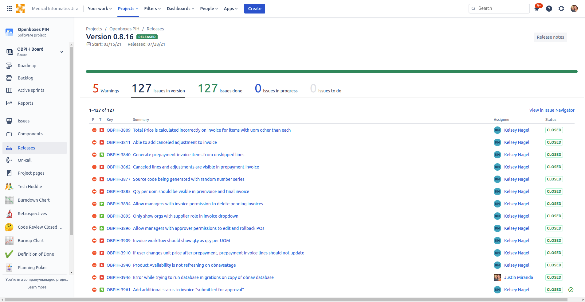
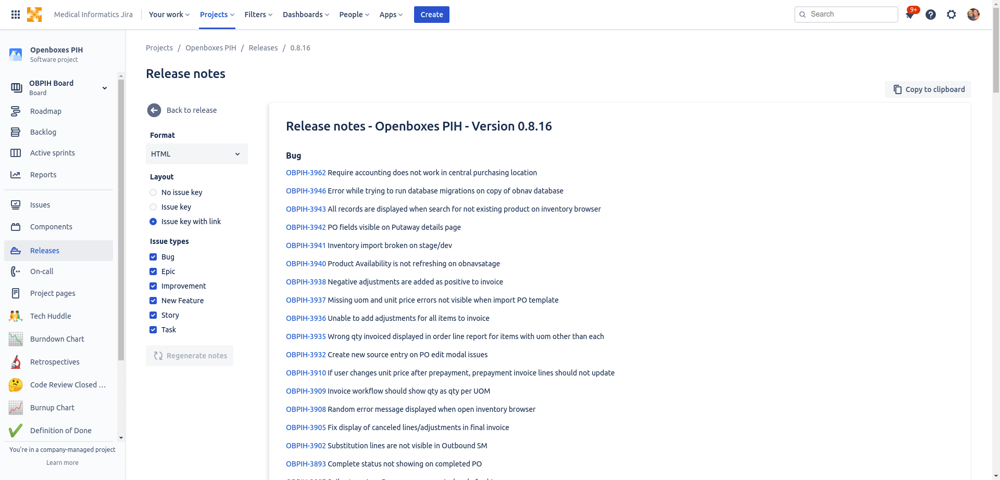

1. Go to Releases page

       

1. View the current release version

       

1. Click the Release Notes button

       

1. Choose Format: Markdown

1. Choose Layout: Issue key

1. Choose the issue types you want to include
   
1. Click the Regenerate notes button

1. Click the Copy to clipboard button 

       
