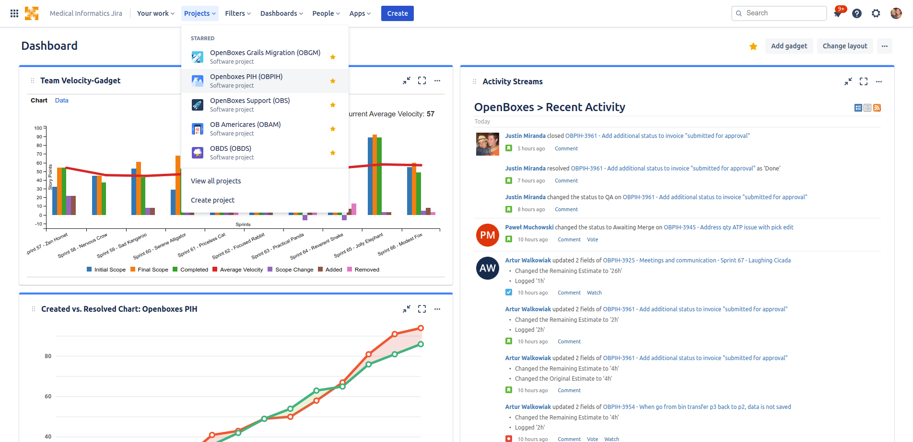

This step usually occurs before development has begun on a new release as the version number 
`fixVersion` is usually attached to a ticket to let us know under what release that ticket should be 
included. However, if you haven't created a new JIRA version by the time you're ready to release 
here's one way to do it. All tickets to be completed within this new version are collectively 
referred to as a Release Backlog.

To create a new version in Jira:

1. Go to the OpenBoxes PIH project

       

1. Click on Releases in the left navigation menu

       

1. Click the Create version button 

1. Enter version number, start date, end date, and a description

1. Click Save

       

