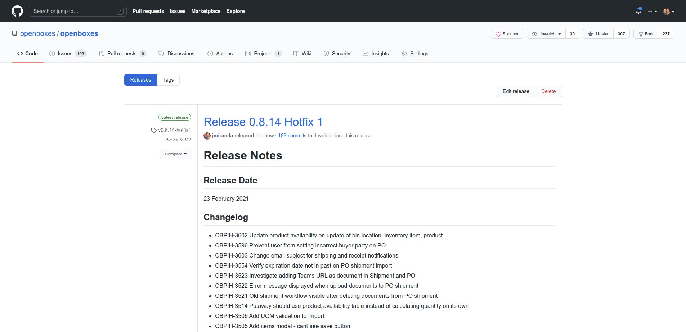

1. Create a Release on GitHub (include Release Notes from JIRA)

    

1. Merge release branch into master

        git checkout master
        git merge release/x.y.z

1. Bump app version (remove -SNAPSHOT)

        git add application.properties
        git commit -m "bumped app version to x.y.z"
        
1. Tag release ([See Tagging section](http://docs.openboxes.com/en/latest/developer-guide/tagging/))
   
        git tag -a vx.y.z -m 'Release x.y.z' 
        git push --tags

1. Push master to remote

        git push

1. Upload WAR to release 

    

1. Publish Release Notes to openboxes.com

    
