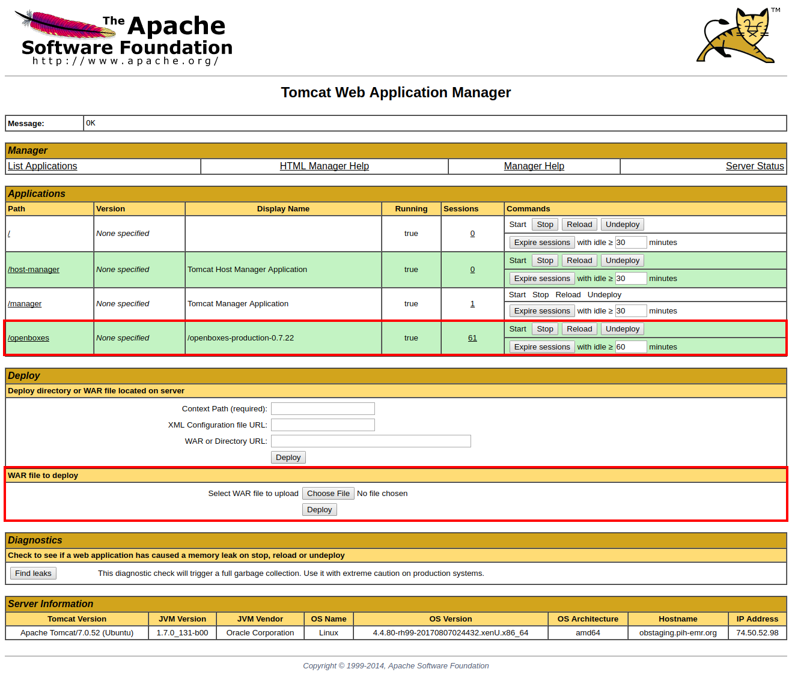

# Upgrading 

## Using Command Line (Ubuntu)
1. SSH into your server
1. Download WAR file from [latest release](https://github.com/openboxes/openboxes/releases/latest) page on GitHub
    ```
    wget https://github.com/openboxes/openboxes/releases/download/<release-tag>/openboxes.war
    ```
1. Shutdown tomcat 
1. Remove existing deployment
    ```
    sudo rm -rf /var/lib/tomcat7/webapps/openboxes*
    ```
1. Copy WAR file to Tomcat webapps directory (NOTE: we need to change the name of the WAR file)
    ```
    sudo cp openboxes-<release-tag>.war /var/lib/tomcat7/webapps/openboxes.war
    ```
1. Start Tomcat (NOTE: this may take awhile if there are lots of data migrations)
1. Check the logs 
    ```
    sudo tail -f /var/logs/tomcat7/catalina.out
    ```

## Using Tomcat Manager 
1. Install Tomcat manager
    ```
    sudo apt-get install tomcat-admin
    ```
1. Add a new user in tomcat-users.xml (`/usr/share/tomcat7/conf/tomcat-users.xml`)
    ```
    <user username="<username>" password="<password>" roles="manager-gui"/>
    ```
1. Restart Tomcat
1. Download WAR file from [latest release](https://github.com/openboxes/openboxes/releases/latest) page on GitHub
    ```
    wget https://github.com/openboxes/openboxes/releases/download/<release-tag>/openboxes.war
    ```
1. Log into Tomcat Manager (using username/password from Step 2)
1. Upload WAR file to Tomcat Manager

1. Restart Tomcat from the command line (optional, but hightly recommended)
