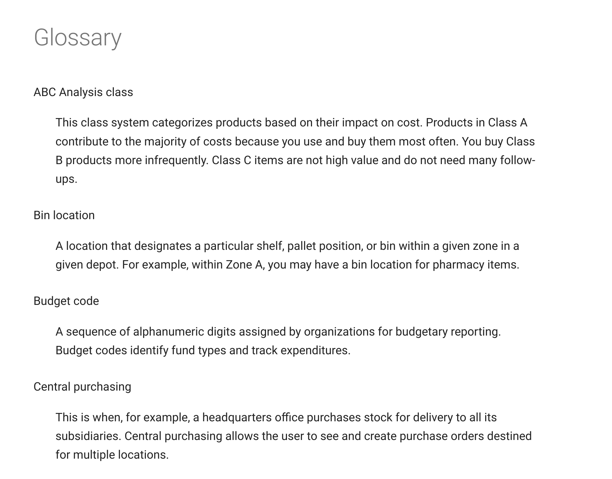
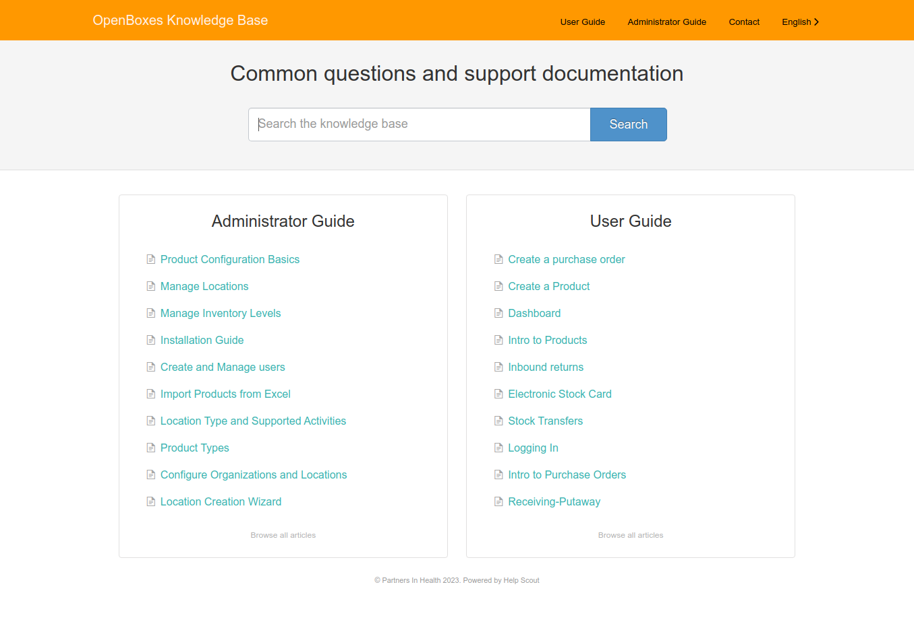
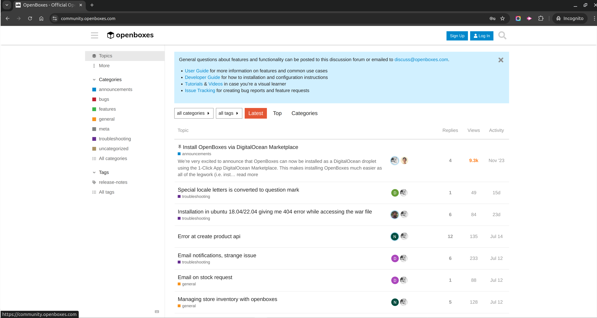
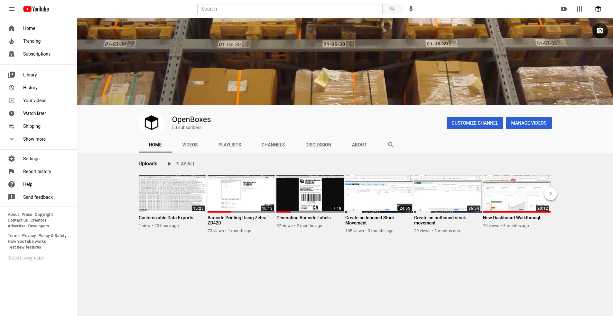
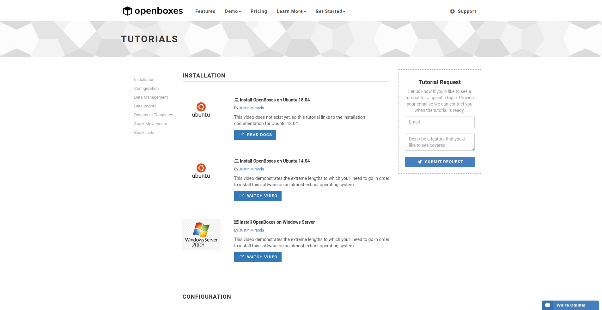

# User Guide

## Resources

-   :material-book-open-page-variant:{ .lg .middle } __Glossary__

    ---

    The glossary serves as a quick reference resource to help understand terminology used in
    OpenBoxes that may be unfamiliar.

    

-   :material-head-lightbulb:{ .lg .middle } __Knowledge Base__

    ---
    
    Search our self-service knowledge base for information and step-by-step instructions 
    on the most common features.

    

-   :material-chat-question:{ .lg .middle } __Community Support__

    ---

    Post your questions to our Community Support discussion forum and search for answers to common questions.

    

-   :material-youtube:{ .lg .middle } __YouTube Channel__

    ---

    Subscribe to our YouTube Channel! Or ... ya know ... don't. It's up to you.

    

-   :material-presentation-play:{ .lg .middle } __Tutorials__

    ---

    Check out our tutorials page for very outdated tutorials.

    

## Contributing
If you would like to contribute to this User Guide, please refer to the 
[Contributing](../developer-guide/contributing.md) section in the Developer Guide 
as well as the [CONTRIBUTING.md](https://github.com/openboxes/openboxes/blob/develop/CONTRIBUTING.md)
docs in our GitHub repository.

If you would prefer to submit documentation updates as Word docs or collaborate with us
using Google Docs, please share the docs or links with our Support Team [support@openboxes.com](mailto:support@openboxes.com).

If you're impatient, not good at words & stuff, and would prefer to see User Guide completed pronto, 
please feel free to light a fire under our documentation expert. The most effective way to do that 
would be to shame him through any of the public support channels (i.e. Twitter, Slack, Google 
Groups, highway billboards, etc). 
