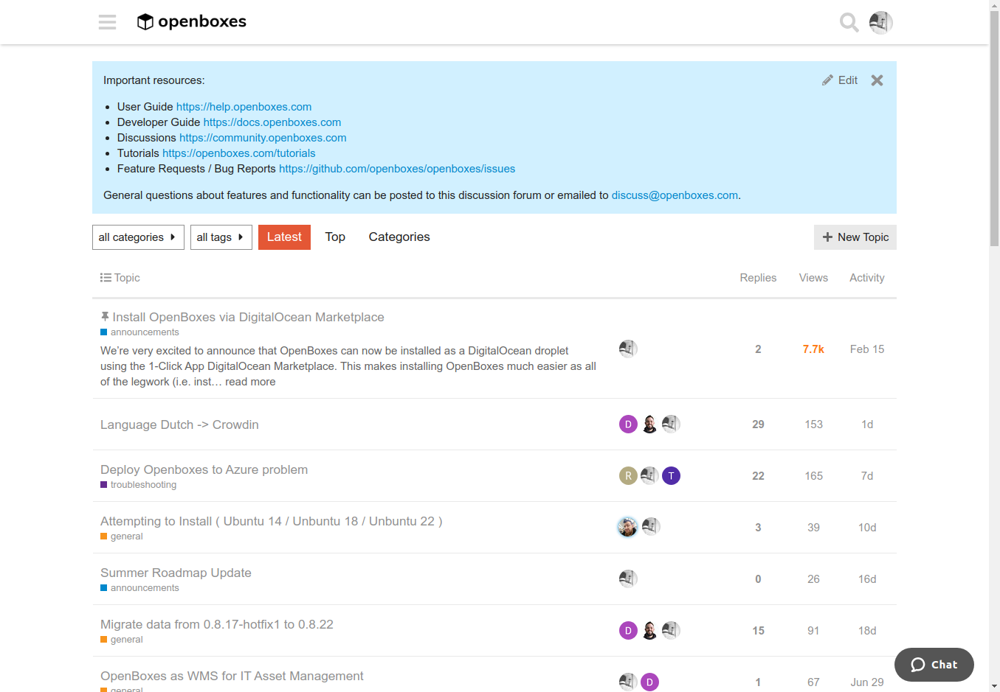

# Getting Started 

## Knowledge Base

Review our knowledge base for step-by-step instructions on the most common features.  

<a href="https://help.openboxes.com">
{height:20%}
</a>

## Discussion Forum

Post your questions to our Community Forum and search for answers to common questions. 

## YouTube channel
Subscribe to our YouTube Channel! Or ... ya know ... don't. It's up to you.

## Tutorials 
Check out our tutorials page for the most up-to-date tutorials.

## Contributing
If you would like to contribute to this User Guide, please refer to the 
[Contributing](../developer-guide/contributing.md) section in the Developer Guide 
as well as the [CONTRIBUTING.md](https://github.com/openboxes/openboxes/blob/develop/CONTRIBUTING.md)
docs in our GitHub repository.

If you would prefer to submit documentation updates as Word docs or collaborate with us
using Google Docs, please share the docs or links with our Support Team [support@openboxes.com](mailto:support@openboxes.com).

If you're impatient, not good at words & stuff, and would prefer to see User Guide completed pronto, 
please feel free to light a fire under our documentation expert. The most effective way to do that 
would be to shame him through any of the public support channels (i.e. Twitter, Slack, Google 
Groups, highway billboards, etc). 
